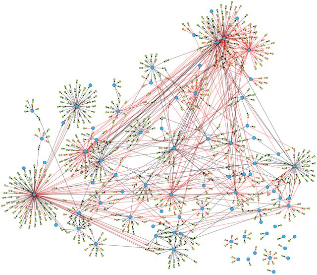
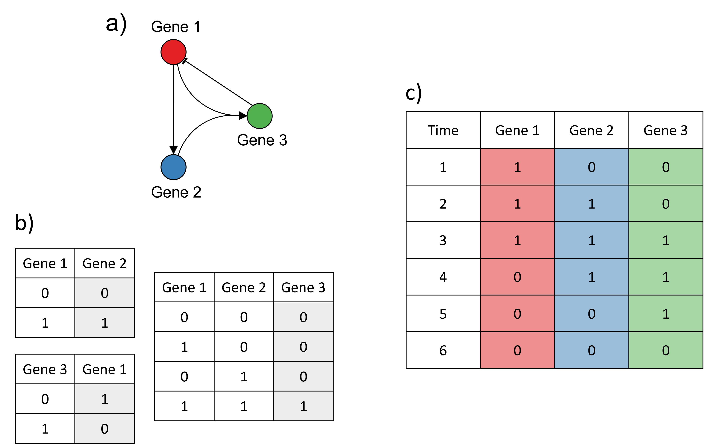
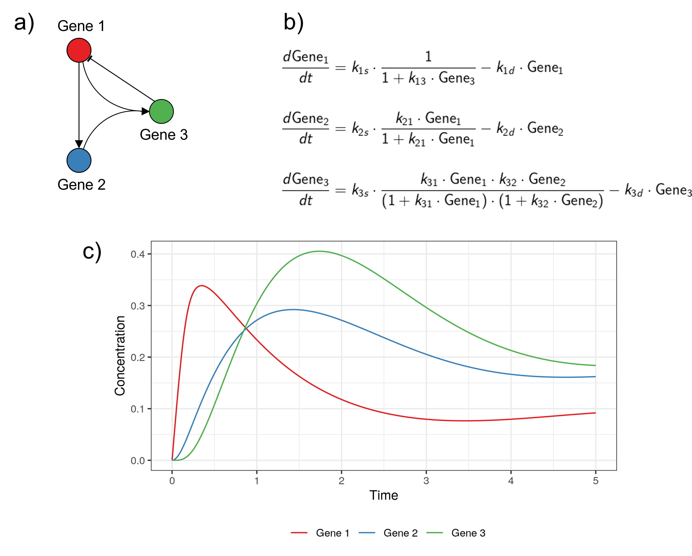
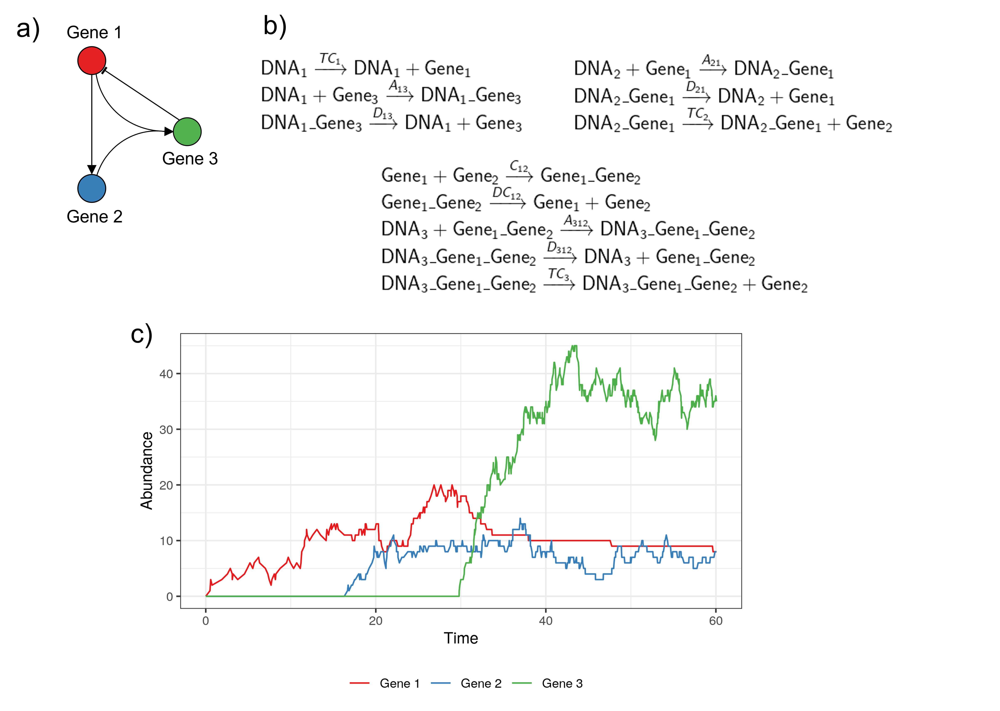
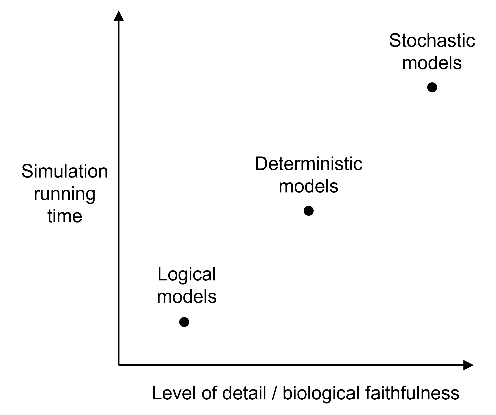
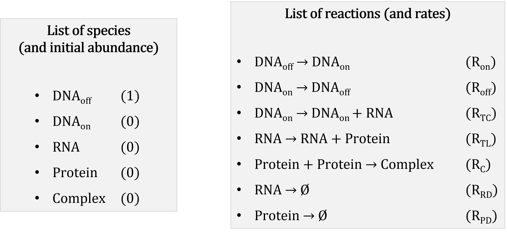
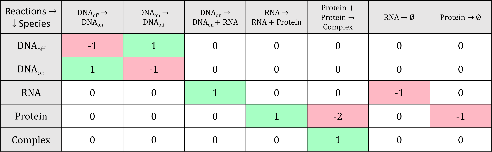
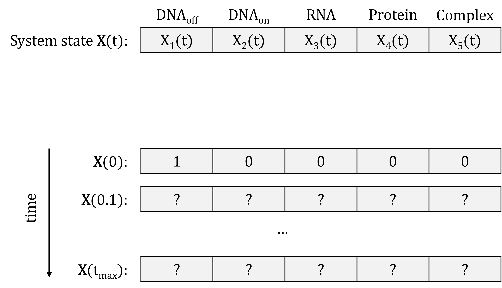
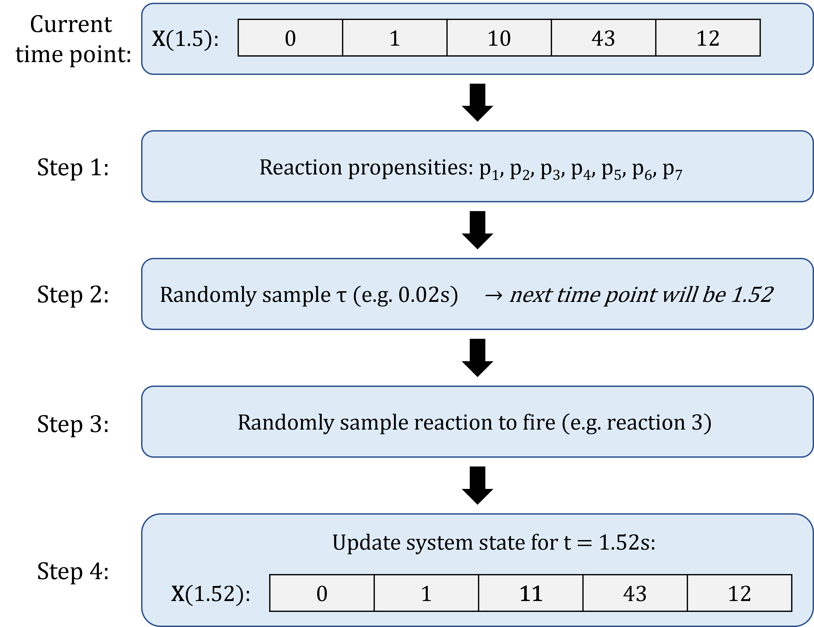
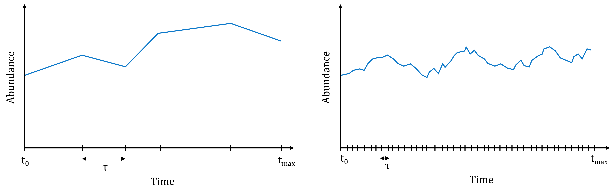

# 1. Introduction

  <b><a href="https://genomicsaotearoa.github.io/Gene_Regulatory_Networks_Simulation_Workshop/">&laquo; Back to homepage</a></b> 
  
    <b><a href="https://genomicsaotearoa.github.io/Gene_Regulatory_Networks_Simulation_Workshop/workshop_material/02_getting_started_sismonr.html">2. Getting started with sismonr &raquo;</a></b>
  

## Outline
* Do not remove this line (it will not be displayed)
{:toc}

Slides are available [here](/Gene_Regulatory_Networks_Simulation_Workshop/workshop_material/workshop_slides.html).

## Why simulations are important in research

One way to answer a research question is through observations and experiments. A scientist can go in the field or the lab to collect data, and analyse them to answer the question. However, this is not the only way to "do" research. The construction of mathematical or statistical models can be an alternative way of testing and generating new hypotheses. It can help us answer questions as "simple" as predicting the movement of planets in the Solar system, or as complex as providing a weather forecast.

> **Model**: mathematical or statistical representation of a system or phenomenon (cell, ecosystem, solar system, etc).

> **Simulation**: Data about the system generated using a mathematical or statistical model.

Modelling and simulations are very powerful tools. In particular, they allow us to:

* explain experimental data, through model fitting and refinement;

* test hypotheses:
  - without going through expensive and time-consuming experiments. For example, with a model of gene expression in a cell, we can predict the impact of knocking out a gene, without going through all the steps necessary to genetically modify a cell in the lab and then record the expression of its genes;

  - that wouldn't be ethical or even feasible to test in real life: e.g. testing the impact of a drug on human embryo development, understanding the merger of two galaxies;

* make predictions about new interventions/scenarios: e.g. what would be the consequences of new mutation in a crop, or the impact of different prevention policies on the spreading of a pandemic...;

* communicate knowledge: e.g. simulations can be use to generate an animation of the formation of a star.

Modelling and simulations are used in many fields of science, including for example:

-   **Epidemiology**: modelling of infectious diseases; for example to predict the spreading of a pandemic and to assess the effects of different prevention measures (see for example a very interesting [talk from Dr Rachel Binny](https://www.youtube.com/watch?v=OhECexc9jt4) on the modelling of the COVID19 response in New Zealand);

-   **Ecology**: modelling of ecosystems, prediction of species abundance, evaluation of conservation policies;

-   **Medicine**: construction of organ models, prediction of drug-target binding and drug efficiency;

-   **Chemistry**, **molecular biology**: molecules interaction models;

-   **Astrophysics**: modelling of planet formation, galaxy mergers (see [this example](https://www.youtube.com/watch?v=QcDtJ_-jdMw)), etc;

-   and many more!

In biology, the study of the interactions between biological entities through modelling and simulations is known as Systems Biology ([Macilwain, 2011](https://doi.org/10.1016/j.cell.2011.02.044)). It is a very interdisciplinary field, building from numerous disciplines (physics, chemistry, biology, computer science, statistics, mathematics, etc). In particular, Systems biologists are interested in understanding the emerging properties of biological systems arising from local interactions between molecular components. This led for example to the construction of a whole-cell computational model ([Kar *et al.*, 2012](https://doi.org/10.1016/j.cell.2012.05.044)).

In this workshop, we are going to work on one of the topics of Systems Biology, which is simulating the expression of genes involved in a Gene Regulatory Network.

## What are Gene Regulatory Networks?

### An overview of gene expression

The instructions necessary to a cell's functioning are encoded in its DNA, which is composed of two anti-parallel chains of nucleotides, intertwined into a double helix. Some portions of this DNA molecule, termed protein-coding genes, contain instructions about the synthesis of proteins, which are important molecular actors fulfilling essential roles in the cell. The complex multi-step process of decoding this information and using it to produce proteins is what we call gene expression. Briefly, gene expression involves:

1.  **Transcription**: the sequence of nucleotides that forms the gene is copied into a "free-floating" version called messenger RNA (mRNA), as the result of a complex series of biochemical interactions involving enzymes and other molecules.
2.  **Translation**: the messenger RNA is used as a template to create proteins; each consecutive triplet of nucleotides is translated into a specific amino acid (the building blocks of proteins). The correspondence between triplets of nucleotides and amino acids is known as the genetic code. A sequence of amino acids is thus created from the messenger RNA template, and, once completed, constitutes the synthesised protein.
3.  **Post-translational modifications**: once synthesised, a protein may have to undergo some transformations before attaining its functional state. Such modifications include changes in its conformation (i.e. the way in which the sequence of amino acids is folded in the 3D space), cleavage of a portion of the amino acid sequence, addition of molecular signals to specific amino acids, or binding to other proteins to form protein complexes.

<small>Image credit: Fondation Merieux</small>

### Regulation of gene expression

Cells respond and adapt to changes in the environment or other inter- and intra-cellular cues by modulating the expression of their genes, which affects the pool of available proteins. Regulation of gene expression can be achieved by different types of molecular actors: proteins encoded by other genes, regulatory non-coding RNAs (i.e. molecules of RNAs that are not used to produce proteins), or even metabolites.

Regulators can control the expression of a given target gene by affecting different steps of the target's expression:

-   **Regulation of transcription**: this is the most well-known type of gene expression regulation. The regulatory molecule (a protein that regulates transcription is called a transcription factor) controls the production of messenger RNAs from the target gene.
-   **Regulation of translation**: the regulatory molecule controls the synthesis of proteins from the target mRNAs.
-   **Decay regulation**: the regulatory molecule affects the rate at which the target mRNAs or proteins are degraded by triggering their decay or protecting them from degradation.
-   **Post-translational regulation**: the regulator modifies the conformation or sequence of its target proteins, thus affecting the ability of the target protein to perform its cellular function.

Regulators that increase the expression of their target are called **activators**; those decreasing the expression of their target are called **repressors**. Typically, the relationship between regulator and target is quite specific, with most regulators controlling the expression of only a few target genes, and most genes being controlled by a small set of regulators.

Information about the regulatory relationships between genes can be summarised into graphs, which we call Gene Regulatory Networks (GRN). In a GRN, nodes represent genes, and a directed arrow from gene A to gene B indicates that the products of gene A control the expression of gene B. An example of GRN is given below.

<small>From Ma, Sisi, et al. "De-novo learning of genome-scale regulatory networks in S. cerevisiae." *Plos one* 9.9 (2014): e106479. (available under license [CC BY 4.0](https://creativecommons.org/licenses/by/4.0/) )</small>

A given environmental cue typically triggers the activation of a specific regulatory pathway (i.e. a part of the cell-wide GRN), with regulators modulating the expression of their targets in a cascade. Thus, understanding the dynamics of gene expression regulation is key to deciphering how organisms react to certain conditions or environmental triggers.

## Simulating Gene Regulatory Networks

One way to understand the dynamics of GRNs is through simulation; i.e. by simulating the expression over time of genes involved in a GRN. Simulating GRNs allows us to:

-   Test hypotheses about the GRN (by comparing gene expression data collected experimentally to simulations based on our current understanding of the network);
-   predict the response of an organism to a specific condition (e.g. predict the behaviour of a human cell in the presence of a hormone);
-   predict the behaviour of the system in response to modifications of the GRN (e.g. what happens when a critical gene is mutated in a cancer cell?);
-   understand the emerging properties of the system (e.g. a specific pattern of regulation leading to a particular cellular behaviour);
-   To evaluate the performance of statistical tools used to reconstruct GRNs from gene expression data (this is the main reason why `sismonr` was developed).

A model of GRN is generally comprised of 2 or 3 components:

- A list of genes and of regulatory interactions between the genes (often presented as a graph);

- A set of rules to convert the regulatory interactions into mathematical or statistical equations;

- A set of numerical parameters that specify the rate of the different reactions in the model (optional, depends on the type of model used).

### Classes of GRN models

There are many types of models that can be developed to simulate GRNs (see [Kalerbach *et al.*, 2008](https://doi.org/10.1038/nrm2503)). For example:

-   **Logical models**: each gene in the GRN is considered as a switch with two states, ON and OFF. Depending on the state (ON or OFF) of a regulator at (discrete) time t and the type of regulation exerted by the regulator on its target (i.e. activative or repressive), the state of the target gene will change (or remain the same) at time t+1;

<small>Example of a logical model. a) The GRN modelled. b) The transition rules from one time point to the next for each edge in the GRN. For each possible state of the regulator(s) (white columns), the corresponding state of the target (grey column) at the next time point is shown. 0 represents the OFF state, 1 represents the ON state. c) Simulation of the model: at each time point, the genes are either ON (1) or OFF (0). Example adapted from Karlebach, G., Shamir, R. Modelling and analysis of gene regulatory networks. *Nat Rev Mol Cell Biol 9*, 770--780 (2008). <https://doi.org/10.1038/nrm2503>. </small>

-   **Continuous and deterministic models**: ordinary differential expressions (ODEs) are used to describe how the concentrations of the different mRNAs and proteins evolve over time. Regulatory functions are used to describe the change in the production of mRNAs or proteins of a target gene as a function of the concentration of regulator molecules.

<small>Example of a continuous and deterministic model, for the same GRN as in the previous example. a) The GRN modelled. b) The system of ODEs used to describe the change in the different genes' concentration over time. The regulatory functions are constructed to match the GRN modelled. c) The trajectories of the model over time (obtained by solving the system of ODEs). The code to reproduce this example is available [here](https://github.com/GenomicsAotearoa/Gene_Regulatory_Networks_Simulation_Workshop/blob/main/scripts/grn_modelling_examples.R). Adapted from Karlebach, G., Shamir, R. Modelling and analysis of gene regulatory networks. *Nat Rev Mol Cell Biol* **9**, 770--780 (2008). <https://doi.org/10.1038/nrm2503>. </small>

-   **Discrete and stochastic models**: biochemical reactions are used to represent the production, transformation and decay of the molecules (DNA, mRNA and proteins) present in the system of interest. A Stochastic Simulation Algorithm (SSA) is used to predict the evolution of the different molecules' absolute abundance over time, by simulating the occurrence of the different reactions in the system.

<small>Example of a discrete and stochastic model. a) The GRN modelled. b) The list of biochemical reactions occuring in the modelled system, with the rate of each reaction indicated above the reaction arrow. c) One simulation obtained with the Stochastic Simulation Algorithm. The code to reproduce this example is available [here](https://github.com/GenomicsAotearoa/Gene_Regulatory_Networks_Simulation_Workshop/blob/main/scripts/grn_modelling_examples.R). </small>

Each type of model has its own advantages and drawbacks.

<small>A very schematic representation of some of the differences between different classes of GRN models.</small>

In this workshop, we will be focusing on the discrete and stochastic class of models. It explicitly accounts for the stochastic noise inherent to biological systems; it is a good option to simulate GRNs as some of the regulatory molecules might be present in small numbers; but the computational burden restricts the simulations to models of GRNs of small size. In a next section, you will learn more about how to simulate expression data from stochastic models using the Stochastic Simulation Algorithm.

### Tools to simulate GRNs

While it is possible to develop "by hand" your own model to simulate the expression of genes for a specific GRN, a number of simulators have been developed, each with its own goals, choice of programming language, and modelling assumptions. A few examples are mentioned below. Note that existing tools generally focus on the simulation of transcription regulatory networks, i.e. only regulation of transcription is accounted for.

**GeneNetWeaver**: [GeneNetWeaver](http://gnw.sourceforge.net/) ([Schaffter et al., 2011](https://doi.org/10.1093/bioinformatics/btr373)) is a Java-implemented software for GRN generation and simulation. Users can either provide their own network graph, or alternatively they can sample a small regulatory network from two possible experimentally derived transcriptional networks (reconstructed respectively from _E. coli_ and _S. cerevisiae_). A deterministic or semi-stochastic model is used to represent the expression of genes and transcription regulations between the genes. The model is then used to simulate time-course RNA and proteins normalised concentration. In addition, it is possible to simulate data for different types of network perturbation, e.g. gene knockouts or knockdowns. 

**CaiNet**: [CaiNet](https://gitlab.com/GebhardtLab/cainet) ([Hettich et al., 2021](https://doi.org/10.1101/872374)) is a Matlab/C++-based interactive tool to construct and simulate GRNs. The user can design in the GUI its own transcription regulatory network, which can include external input signal,  homo- and heterodimerisation (i.e. the binding of two identical or different proteins to form protein complexes), and enzyme-aided metabolic reactions. A model is then constructed, using a mix of probabilistic and deterministic equations. The simulations are sped-up by simulating individually each gene for short time-steps, then synchronising the different gene expression levels across the entire system. In addition, CaiNet offers a module for the inference of GRN topology and parameters from steady-state gene expression data.

**MeSCoT**: [MeSCoT](https://genetics.ghpc.au.dk/vimi/mescot/) ([Milkevych *et al.*, 2021](https://doi.org/10.1093/g3journal/jkab133)) is a tool for generating and simulating GRNs impacted by genetic mutations and resulting quantitative phenotypes. This is particularly interesting for people working on QTL mapping or GWAS analyses for example. They use stochastic differential equations with time delay to construct the model. 

In this workshop, we will use the [sismonr](https://github.com/oliviaAB/sismonr) R package. sismonr generates GRNs that include protein-coding and non-coding genes, and models different types of expression regulation, such as regulation of transcription, translation, RNA or protein decay, and post-translational modifications. sismonr constructs a stochastic model to simulate the abundance of RNAs and proteins in the system over time. 

### A (brief) introduction to the Stochastic Simulation Algorithm

In this section, we will see in more details the different components of a stochastic model and how we can use a Stochastic Simulation Algorithm to simulate the model. This is important as it is the type of model and simulation that we are going to work with for the next two days.
  
A stochastic model consists of:

- a list of (molecular) species present in the system of interest: in our case that would be the different genes, RNAs, proteins, etc.
- a list of initial abundance for each species in the system, i.e. the number of molecules of each species present in the system at the beginning of the simulation;
- a list of biochemical reactions that can occur in the system: e.g. substrate 1 (S1) binds with enzyme A (EA) to form a complex (C1A), represented on the form S1 + EA → C1A
- a list of constant rates, one per reaction, that represent for  a given reaction the probability of one molecule of each reactant colliding and undergoing the reaction in the next time step.

<small>Example of a stochastic model.</small>

Mathematically, the biochemical reactions are usually represented with a **stoichiometry matrix**, in which each row corresponds to a species and each column to a reaction. The cells indicate the change in abundance of the different species resulting from one occurrence of the reactions; negative values indicate the reactants of the reactions, while positive values indicate their products.

<small>The stoichiometry matrix of the example stochastic model. Notice that in reactions 3 and 4, a species appears as both a reactant and a product, and so is not represented in the stoichiometry matrix. This is because the species is necessary for the reaction, but is not degraded or transformed by the reaction.</small>

We can represent the state of the system at a given time point $t$ as a vector of species abundance: $\mathbf{X}(t) = \left( X_1(t), \ldots, X_N(t) \right)$, where $X_i(t)$ is the abundance of species $i$ at time $t$. We already know what the system state is at time point $t = 0$: this is the initial abundance of the species that we decided on. The goal of  the simulation is to simulate the system state over a period of time (say until time point $t_{max}$):

<small>The system state.</small>

In order to do that, we need to simulate the series of occurrence of the reactions. But how do we know which reaction will occur first? and when? We can answer these questions by calculating for each reaction its propensity: the probability of the reaction to "fire" (to occur) in the next unit (small) time-step. The propensity of a reaction depends on:

- The constant rate of the reaction, which is the probability of one molecule of each reactant species to collide and undergo the reaction; and
- The state of the system at the current time point: more specifically, the abundance of the reactant species. Think about it: a reaction for which one of the reactant is present in very low abundance will have a very low probability of occurring. On the other hand, a reaction for which all reactants are very abundant will likely occur in the next time step.

The general formula is, for a reaction $i$ with constant rate $r_i$ and $j$ reactants:

$p_j(\mathbf{X}) = r_i \times \sum\limits_{\text{reactants }j} X_j(t)$

Which gives, for the reactions in our example:

<small>Propensities of some of the reactions.</small>

A typical Stochastic Simulation Algorithm will generate the simulation as follows:

0. Initialisation: Start with the initial system state, and set $t = 0$.
1. Compute the propensity of all reactions, based on the current state of the system;
2. Based on the propensities, randomly generate the time increment $\tau$ during which the next reaction will occur;
3. Based on the propensities, randomly select which reaction will occur between $t$ and $t+ \tau$;
4. Update time to $t + \tau$, update the system state based on which reaction occurred;
5. Repeat steps 1 to 4, until $t = t_{max}$ (the desired end time of the simulation).

An example is shown below: 

<small>Example of one iteration of the SSA.</small>

This means that the Stochastic Simulation Algorithm simulates the occurrence of every single reaction in the system. The downside of that is that if several reactions have high propensities, then the interval of time sampled at each iteration of the algorithm will be really small, and so the algorithm will have to go through many iterations before reaching the end of the simulation. This occurs typically when some of the species are present in very high abundance in the system.

<small>Illustration of the computational burden of the Stochastic Simulation Algorithm. Left: if reactions all have small propensities, the simulated time intervals are rather large, and the simulation will end quickly. Right: if on the contrary reactions have high propensities, many reactions will occur in short periods of time, and it will take many iterations to reach the end of the simulation.</small>

Many variations of this stochastic simulation algorithms have been proposed, to reduce the computational burden of the simulations. Some are exact, i.e. they will simulate the occurrence of each reaction in the system; while other are approximate, i.e. they will try to speed up the calculations at the expense of accuracy.

There are many implementations of the different versions of the Stochastic Simulation Algorithm, in the language of your choice: for example the R packages [GillespieSSA](https://CRAN.R-project.org/package=GillespieSSA) and [adaptivetau](https://CRAN.R-project.org/package=adaptivetau), the Python module [gillespie](https://github.com/sueskind/gillespie), the Julia module [BioSimulator.jl](https://alanderos91.github.io/BioSimulator.jl/stable/), and many (or at least a few) more.

The sismonr packages uses under the hood the Julia module [BioSimulator.jl](https://alanderos91.github.io/BioSimulator.jl/stable/) to perform the stochastic simulations. You will learn a bit more about how sismonr links R and Julia in the next section.

---

  <b><a href="https://genomicsaotearoa.github.io/Gene_Regulatory_Networks_Simulation_Workshop/workshop_material/02_getting_started_sismonr.html">2. Getting started with sismonr &raquo;</a></b>

  <b><a href="https://genomicsaotearoa.github.io/Gene_Regulatory_Networks_Simulation_Workshop/">Back to homepage</a></b>

