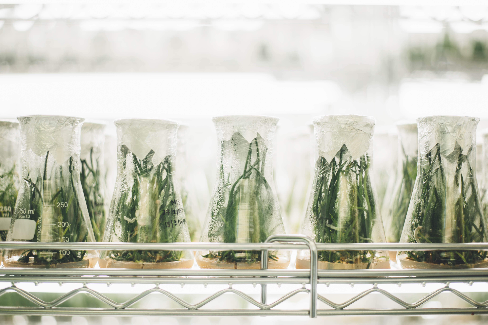
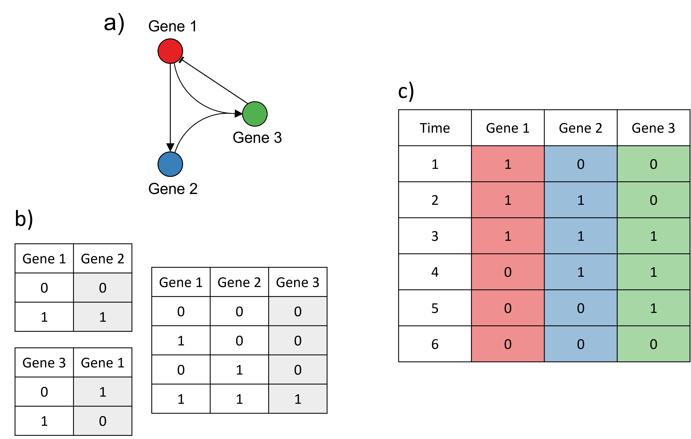
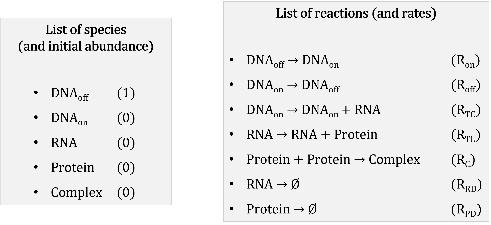
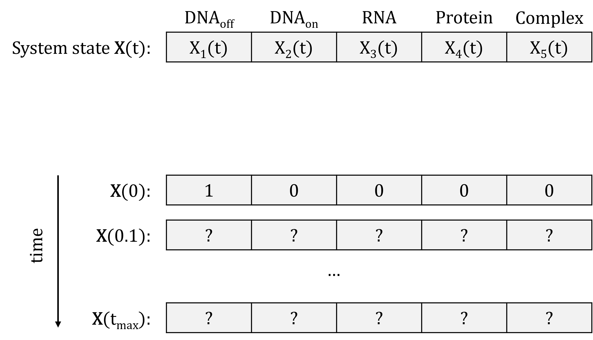
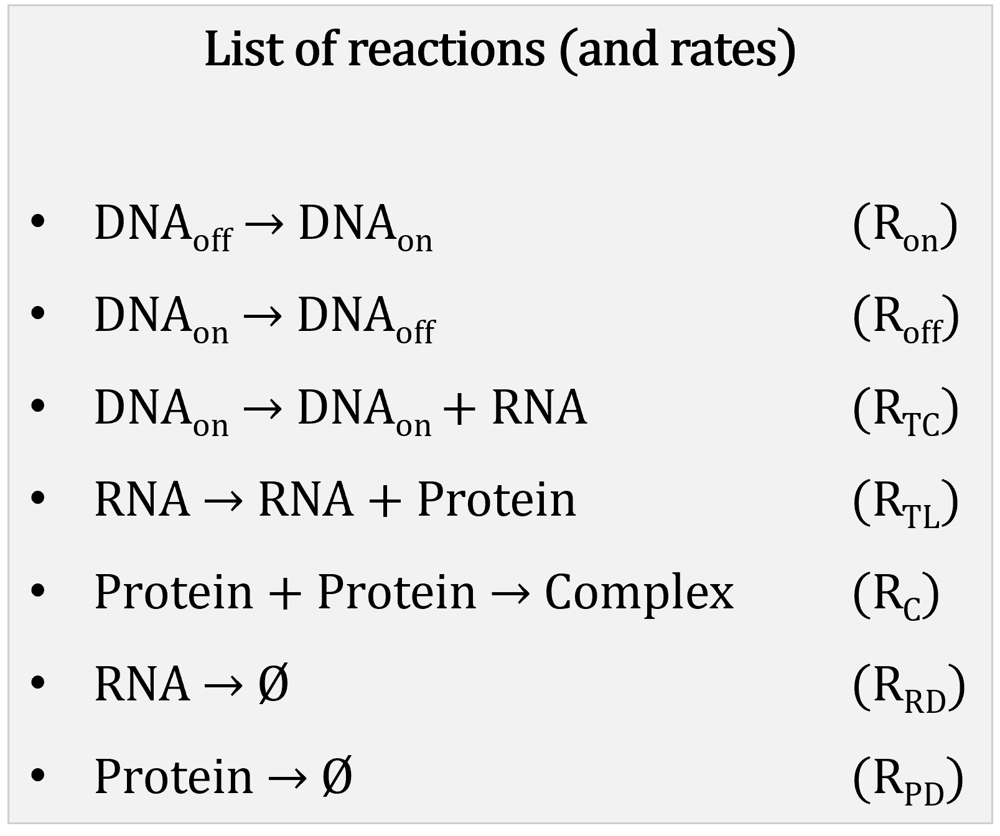

class: center, middle

# 1. Introduction


```{r setup, include=FALSE}
options(htmltools.dir.version = FALSE)
```

---
class: inverse, center, middle

## Why simulations are important in research

---
# Why simulations are important in research

<br />
<br />

.pull-left[

<small>Photo by <a href="https://unsplash.com/@jkoblitz?utm_source=unsplash&utm_medium=referral&utm_content=creditCopyText">Julia Koblitz</a> on <a href="https://unsplash.com/s/photos/experiment?utm_source=unsplash&utm_medium=referral&utm_content=creditCopyText">Unsplash</a> </small>
]

.pull-right[

<small>Photo by <a href="https://unsplash.com/@chuttersnap?utm_source=unsplash&utm_medium=referral&utm_content=creditCopyText">CHUTTERSNAP</a> on <a href="https://unsplash.com/s/photos/experiment?utm_source=unsplash&utm_medium=referral&utm_content=creditCopyText">Unsplash</a></small>
]

---

## Why simulations are important in research

<br />

> **Model**: mathematical or statistical representation of a system or phenomenon (cell, ecosystem, solar system, etc).

<br />

> **Simulation**: Data about the system generated using a mathematical or statistical model.

---

## Why simulations are important in research

Models and simulations allow us to:

* Explain experimental data (through model fitting and refinement);

--

* Test hypotheses:
  - without going through expensive and time-consuming experiments;
  
  - that wouldn’t be ethical or even feasible to test in real life:
  
--

* Make predictions about new interventions/scenarios;

--

* Communicate knowledge.

---

## Why simulations are important in research

Modelling and simulations are used in many fields of science, e.g.:

* **Epidemiology**: modelling of infectious diseases (see this [talk on COVID-19 modelling](https://www.youtube.com/watch?v=OhECexc9jt4));

--
 
* **Ecology**: modelling of ecosystems, prediction of species abundance, evaluation of conservation policies;

--

* **Medicine**: construction of organ models, prediction of drug-target binding and drug efficiency;

--

* **Chemistry**, **molecular biology**: molecules interaction models;

--

* **Astrophysics**: modelling of planet formation, galaxy mergers (see [this example](https://www.youtube.com/watch?v=QcDtJ_-jdMw));

--

* and many more!

---

## Why simulations are important in research

> **Systems Biology**: the study of the interaction between biological entities through modelling and simulations


--

* Interdisciplinary field: builds on physics, chemistry, biology, computer science, statistics, mathematics, etc

--

* Interest in understanding the emerging properties of biological systems arising from local interactions between molecular components


--

* Construction of whole-cell computational model of the human pathogen *Mycoplasma genitalium*: [Kar *et al.*, Cell (2012)](https://doi.org/10.1016/j.cell.2012.05.044)

---
class: inverse, center, middle

# What are Gene Regulatory Networks?

---

## An overview of gene expression

.center[
  
  
<small>Credit: Fondation Merieux </small>
]

---

## Regulation of gene expression

* Cells adapt to changes in environment by modulating the expression of their genes

--

* Gene expression regulated by different types of molecules:

  - proteins
  
  - regulatory non-coding RNAs
  
  - small metabolites

---

## Regulation of gene expression

Expression of a target gene can be controlled in different ways:

--

* Regulation of **transcription** (regulatory proteins called transcription factors or TFs)
  
--

* Regulation of **translation**  

--

* Regulation of **gene products' decay** (RNAs and proteins)

--

* **Post-translational** regulation (modification of sequence or shape of target proteins)

--

<br />

Regulation that increases the target's expression $\rightarrow$ **activation**

Regulation that reduces/suppresses the target's expression $\rightarrow$ **repression**

---

## Gene Regulatory Networks

.center[


<small>From Ma, Sisi, et al. "De-novo learning of genome-scale regulatory networks in S. cerevisiae." *Plos one* 9.9 (2014): e106479. (available under license [CC BY 4.0](https://creativecommons.org/licenses/by/4.0/) )</small>
]

---

## Gene Regulatory Networks

Not all genes linked to all others: relationship between regulator and target usually very specific

* most targets controlled only by a few regulators;

* most regulators control only a few targets;

* some "hub" or "master" regulators.

---
class: inverse, center, middle

## Simulating Gene Regulatory Networks

---

## Why simulating GRNs?

* to test hypotheses about the GRN (e.g. by comparing simulations to experimental data);

--

* to predict the response to a specific condition;

--

* to predict the response of the system to a modification of the GRN;

--

* to understand the emerging properties of the system;

--

* to evaluate the performance of statistical tools used for GRN reconstruction from gene expression data.

---

## Building blocks of a GRN model

* A list of regulatory interactions between the genes (often represented as a graph);

--

* A set of rules to convert the regulations into a mathematical or statistical model;

--

* (optional, depends on the model): A set of numerical parameters specifying the rate of the different reactions in the model.

--

<br />

There are many types of models that can be used to model GRNs!

---

## Logical models

.center[


<small>Example adapted from Karlebach, G., Shamir, R. Modelling and analysis of gene regulatory networks. *Nat Rev Mol Cell Biol 9*, 770--780 (2008). <https://doi.org/10.1038/nrm2503>. </small>
]

---

## Continuous and deterministic models

.center[


<small>Example adapted from Karlebach, G., Shamir, R. Modelling and analysis of gene regulatory networks. *Nat Rev Mol Cell Biol 9*, 770--780 (2008). <https://doi.org/10.1038/nrm2503>. </small>
]

---

## Discrete and stochastic models

.center[


<small>R code to reproduce the last two examples available [here](https://github.com/GenomicsAotearoa/Gene_Regulatory_Networks_Simulation_Workshop/blob/main/scripts/grn_modelling_examples.R). </small>
]

---

## Different types of GRN models

Each type of model has its own advantages and drawbacks.

.center[

]


---

## Different types of GRN models

In this workshop, we'll focus on discrete and stochastic models:

* good options to simulate species with very **low abundance per cell** (e.g. regulatory molecules);

* **computationally heavy**: restricts the size of the models that can be simulated.

---

## Some tools to simulate GRNs (not exhaustive!)

* [GeneNetWeaver](http://gnw.sourceforge.net/): for deterministic or semi-stochastic modelling;

* [CaiNet](https://gitlab.com/GebhardtLab/cainet): mix of probabilistic and deterministic equations;

* [MeSCoT](https://genetics.ghpc.au.dk/vimi/mescot/): stochastic modelling with time-delay;

* [**sismonr**](https://CRAN.R-project.org/package=sismonr): R package for stochastic modelling.

---
class: inverse, center, middle

## A brief introduction to the Stochastic Simulation Algorithm

---

## A stochastic model

A stochastic model consists of:

<br />

.center[

]

---

## Mathematical representation of a stochastic model

Reactions represented with a **stoichiometry matrix**:

<br />

<br />

.center[

]

---

## Mathematical representation of a stochastic model

**System state** represented as vector of species abundance at a given time point:

<br />

.center[

]

---

## Reactions propensities

To simulate the system, need to know which reaction will fire when:

> Reaction **propensity**: probability of the reaction to occur in the next (small) unit time step

--

<br />

Propensity depends on:

* constant rate of reaction;

--

* state of the system at the current time point:
  
  - few reactants present in the system $\rightarrow$ low chance of the reaction occurring;
  
  - reactants abundant in the system: $\rightarrow$ high chance of the reaction occurring.
  
  
---

## Reactions propensities

.pull-left[
In our example: 
]
.pull-right[

]


.center[

]

---

## Basic concept of the Stochastic Simulation Algorithm

* Initialisation: set $t = 0$, and initial system state as initial species abundance.

--

1. Compute reactions propensities, based on current system state.

--

2. **Randomly** generate time increment $\tau$ during which next reaction occurs.

--

3. **Randomly** select which reaction will occur between $t$ and $t+ \tau$.

--

4. Update time to $t + \tau$ and system state based on which reaction occurred.

--

5. Repeat steps 1 to 4, until $t = t_{max}$.

---

## An example of one SSA iteration

.center[

]

---

## Advantage and drawback

* Advantage: every single reaction simulated!

--

* Downside: if many reactions with high propensities, each time increment will be really small $\rightarrow$ will take a long time to get to the end of the simulation

<br />

.center[

]

---

## Many versions of the SSA!

* There exist many variations of the SSA:

  - **exact** versions: simulate the occurrence of every single reaction;
  
  - **approximate** versions: trade-off between accuracy and computational burden.
  
--

* Several implementations of the SSA:
  - R: [GillespieSSA](https://cran.r-project.org/package=GillespieSSA), [adaptivetau](https://cran.r-project.org/package=adaptivetau)
  - python: [gillespie](https://github.com/sueskind/gillespie)
  - Julia: [BioSimulator.jl](https://alanderos91.github.io/BioSimulator.jl/stable/)<sup>*</sup> 

.footnote[[*] Used by the sismonr package that we are going to use!]

---
class: center, middle

# 2. Getting started with sismonr

---
class: inverse, center, middle

## Introduction to the sismonr package

---

## The sismonr package

* sismonr was developed for the purpose of generating benchmark datasets to assess the performance of network reconstruction methods

--

* Objectives:
  - include the effect of **small genetic mutations** in the GRN to mimic genetic variability between individuals;

--

  - allow the simulation of **polyploid** systems (i.e. more that 2 copies of each gene present in the system);
  
--

  - model **post-transcriptional** regulation;
  
--

  - transparent model, **customisable** by the user;
  
--

  - generate **random but plausible GRNs** or use GRN provided by user.
  
--

<br />

A complete sismonr tutorial is available [here](https://oliviaab.github.io/sismonr/).

---

## sismonr: linking R and Julia

 can be slow for intensite computations $\rightarrow$ sismonr uses  under the hood!

--

.center[
sismonr uses the [XRJulia](https://cran.r-project.org/package=XRJulia](https://cran.r-project.org/package=XRJulia) package to link R and Julia:

]

---

## sismonr: linking R and Julia

* Socket connection initialised on a random port $\rightarrow$ can get messy when working on a HPC...

--

Solution:

```{r eval = FALSE}
> XRJulia::newJuliaEvaluator(port = as.integer(456))
```

---
class: inverse, center, middle

## Practice time!

---

## Some sismonr abbreviations

| Abbreviations | Meaning                         |
|---------------|---------------------------------|
| TC            | Transcription                   |
| TL            | Translation                     |
| RD            | RNA decay                       |
| PD            | Protein decay                   |
| PTM           | Post-translational modification |
| PC            | Protein-coding                  |
| NC            | Noncoding                       |
| R             | RNA                             |
| P             | Protein                         |
| Pm            | Modified protein                |
| C             | Regulatory complex              |


This table can also be found [here](https://genomicsaotearoa.github.io/Gene_Regulatory_Networks_Simulation_Workshop/workshop_material/02_getting_started_sismonr.html#practice-time).

---

## Login to NeSI Mahuika Jupyter

Instructions in the [Supplementary Material](https://genomicsaotearoa.github.io/Gene_Regulatory_Networks_Simulation_Workshop/workshop_material/07_supplementary.html)

<br />

**IMPORTANT:** do not forget to change your working directory!

.center[

]
