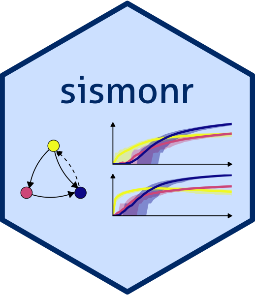
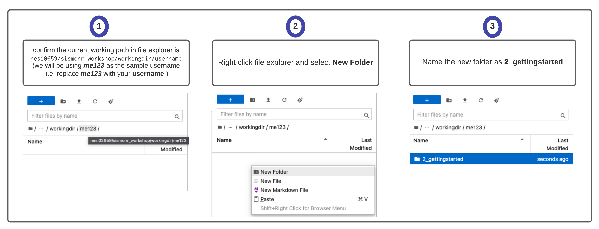
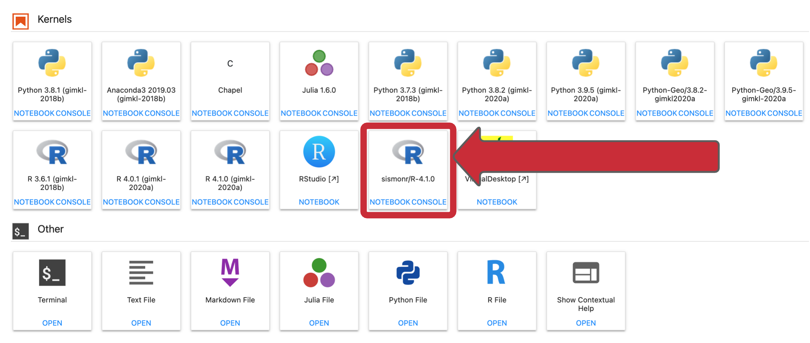
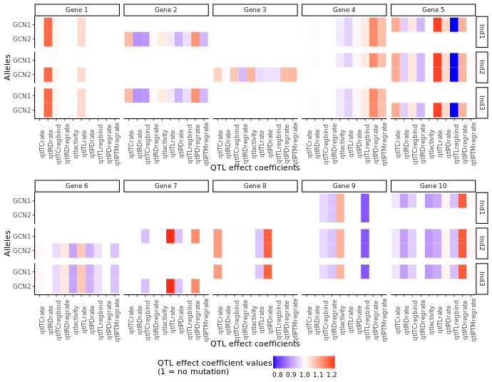
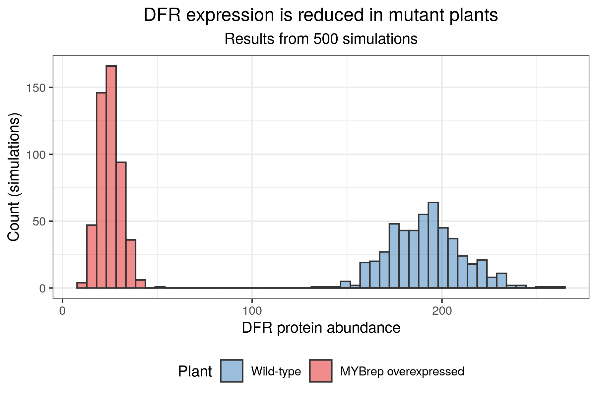

# 2. Getting started with sismonr

<center>{width="200"}</center>

## Introduction to the sismonr package

!!! quote ""

    The sismonr package was developed for the purpose of generating benchmark datasets, in order to assess the performance of statistical methods that reconstruct GRNs from experimental datasets such as RNAseq data. Therefore, sismonr allows the user to generate random GRNs that mimic some of the properties of biological regulatory networks. Alternatively, the user can construct their own regulatory network. sismonr can supports different types of regulation (e.g. transcription, translation or decay regulation). Genes can code for proteins or for non-coding regulatory RNAs; gene products can form regulatory complexes. One unique features of sismonr is that it allows the user to define the ploidy of the system, i.e. how many copies of each gene are present in the system. Lastly, sismonr simulates the expression of the genes in a GRN for different *in silico* individuals, that carry different versions (or alleles) of the genes present in the GRN (think of it as simulating gene expression from different subjects). This is quite useful to simulate gene expression under different scenarios such as gene knock-outs for example. If you are interested, a full tutorial is available [here](https://oliviaab.github.io/sismonr/).
    
One particularity of sismonr is that it is available as an R package; but internally it uses the programming language Julia to speed up some of the calculations. No worries though, you don't need to know anything about Julia to use sismonr!

### How sismonr links R and Julia

Before we get into the fun part, which is getting to play with the sismonr package, it is important to know a little bit about sismonr works. More specifically, we will now briefly cover how sismonr uses Julia to run the simulations and other computations. This will be important when scaling-up our work from a local machine to a HPC environment.

sismonr handles communications between R and Julia via the [XRJulia](https://cran.r-project.org/package=XRJulia](https://cran.r-project.org/package=XRJulia)) R package. The first time you use a function from the sismonr package that requires Julia, sismonr (via XRJulia functions) opens a new julia process on your computer, and sets up a socket connection between the R session and the new julia process. 

By default, this connection is set up on a random port, but there are ways to decide on the port to use: by executing, at the start of your R session, the following command:

```r
XRJulia::newJuliaEvaluator(port = as.integer(456))
```
you are creating a new Julia process and the socket connection between the R session and the Julia process will use port 456. We won't need to use this for now, but you will find it useful later on :)

Once the Julia process is started, whenever sismonr needs to run some computations in Julia, the necessary R objects are sent to the Julia process, which executes the required commands. Once done, the Julia process sends back the results to the R session. This way, the user doesn't have to interact with Julia at all.


{width="900"}
<br><center><small> A very schematic representation of how sismonr uses the XRJulia package to run simulations in Julia from a R session. </small></center></br>

This is why, if you decide to use sismonr on your own computer, you will have to install Julia first, and make sure that R can find the Julia executable (for example by adding Julia to the PATH, which is done for you when installing Julia).

### Practice time!

For this next section, you will need to login to NeSI Mahuika Jupyter and to open a sismonr Jupyter notebook. See [here](https://genomicsaotearoa.github.io/Gene_Regulatory_Networks_Simulation_Workshop/workshop_material/07_supplementary.html) for instructions on how to login to NeSI Mahuika Jupyter and how to open a sismonr Jupyter kernel. **Follow instructions up to S.2 2 (Guide Jupyter file explorer (left panel) to above working directory) included.**

Before opening a Jupyter Notebook, we will create a folder to save our work from this section:

<br>
{width="900"}
</br>

Now we can open a sismonr Jupyter Notebook:


<br>{width="900"}</br>


Before getting started, here are some abbreviations that are often used within sismonr:

<center>

| Abbreviations | Meaning                         |
|---------------|---------------------------------|
| TC            | Transcription                   |
| TL            | Translation                     |
| RD            | RNA decay                       |
| PD            | Protein decay                   |
| PTM           | Post-translational modification |
|               |                                 |
| PC            | Protein-coding                  |
| NC            | Noncoding                       |
|               |                                 |
| R             | RNA                             |
| P             | Protein                         |
| Pm            | Modified protein                |
| C             | Regulatory complex              |

</center>

### Generating a random GRN

We will start by generating a small random GRN with sismonr, using the function `createInSilicoSystem()`.

```r
library(sismonr)
set.seed(12) # important for reproducibility of "random" results in R!
small_grn <- createInSilicoSystem(G = 10, # number of genes in the GRN
                                  PC.p = 1, # proportion of genes that are protein-coding
                                  ploidy = 2) # ploidy of the system
```

Note that the first time you run a sismonr command, you might have to wait a few seconds, as sismonr needs to open a new Julia process on your computer to execute some of the internal commands (such as the generation of a random GRN).

You can visualise the GRN you just created with the following command (the resulting graph is interactive, try to hover over nodes or edges with your mouse, move nodes or click on nodes):

```r
plotGRN(small_grn)
```
<div class="map">
<iframe width=700, height=500 frameBorder=0 src="./images/sismonr_network.html"></iframe>
</dev>

Alternatively, you can get a list of the genes and regulatory relationships in the GRN through:

```r
getGenes(small_grn)
```
```
   id coding TargetReaction PTMform ActiveForm       TCrate      TLrate       RDrate       PDrate
1   1     PC             TC       0         P1 0.0010706485 0.115208445 0.0006563273 0.0003594616
2   2     PC             PD       0         P2 0.0007063012 1.096787613 0.0002886745 0.0008614784
3   3     PC             TC       0         P3 0.0010690560 0.016254643 0.0004565128 0.0002589524
4   4     PC             TC       0         P4 0.0020231676 0.006923935 0.0008362586 0.0011683879
5   5     PC             TC       0         P5 0.0017721606 0.021329358 0.0011665348 0.0004787676
6   6     PC             TL       0         P6 0.0011366749 0.017786830 0.0008228596 0.0002831087
7   7     PC             TL       0         P7 0.0052234381 0.060540559 0.0007973883 0.0007609887
8   8     PC             TL       0         P8 0.0026365016 0.017948936 0.0006848954 0.0003388916
9   9     PC             TL       0         P9 0.0030150020 0.140724990 0.0006802817 0.0002328448
10 10     PC             TC       0        P10 0.0015819471 0.007701612 0.0006157945 0.0005439300
```

and:

```r
getEdges(small_grn)
```

```
   from to TargetReaction RegSign RegBy
1     4 10             TC       1    PC
2     5 10             TC      -1    PC
3     3  2             TC      -1    PC
4     1  3             TC       1    PC
5     3  3             TC       1    PC
6     5  5             TC       1    PC
7  CTC1  9             TC      -1     C
8     7  2             TL       1    PC
9     9  4             TL      -1    PC
10    6  7             TL      -1    PC
11    8  7             TL      -1    PC
12    2  1             PD       1    PC
```

Note that you can modify the properties of your system by changing the values in these data-frames.

The `createInSilicoSystem` function accepts many arguments allowing the user to customise the GRN to be created. You can find a list of these by tying:

```r
?insilicosystemargs 
```

For example, you can generate a network of 5 genes with only protein-coding genes that are regulators of transcription with:

``` r
set.seed(45)
another_grn <- createInSilicoSystem(G = 5, 
                                    PC.p = 1, 
                                    PC.TC.p = 1) # all protein-coding genes are
                                                 # regulators of transcription
```


### Modifying a GRN

In addition, you can add genes in your GRN, and add or remove regulatory relationships between genes (currently it is not possible to remove genes, this option will be added in the future).

When adding a gene, you can specify its kinetic parameters, e.g. its transcription rate (in RNA/sec), RNA decay rate, etc.

``` r
small_grn2 <- addGene(small_grn, 
                      coding = "PC", 
                      TCrate = 0.01,
                      RDrate = 0.005)
```

Same thing when adding an edge to the GRN: you can decide if the regulation is activative or repressive, and the different rates of the regulation:

``` r
small_grn3 <- addEdge(small_grn2, regID = 11, tarID = 8, regsign = "1")
```

### Simulating genetically diverse *in silico* individuals

Two individuals from a same species are not genetically identical. They carry the different versions (called alleles) of the same genes. Genetic mutations in or around a gene influence the dynamics of gene expression. To account for that, sismonr does not directly simulate the expression of genes in a GRN, but simulates the expression of the genes for different *in silico* individuals. More details can be found in the [sismonr tutorial](https://oliviaab.github.io/sismonr/#creating-an-in-silico-population). 

Once you've created a GRN with sismonr, you can generate *in silico* individuals with the `createInSilicoPopulation` function. For example, let us generate 3 random *in silico* individuals; we'll assume that for each gene, they can carry one of 2 possible alleles (this can be customised further but we won't go into details).

``` r
set.seed(123)
small_pop <- createInSilicoPopulation(3, # number of individuals
                                      small_grn, # our GRN
                                      ngenevariants = 2) # how many alleles exist per gene
```

We can visualise the difference between the individuals via:

```r
plotMutations(small_pop, small_grn, nGenesPerRow = 5)
```



<small>A plot representing, for each *in silico* individual (rows) and each gene (columns), the effect (colour) of genetic mutations on different aspects of the gene's expression (x-axis) for each allele (y-axis) carried by the individual. For noncoding genes, some QTL effect coefficients are not relevant (the ones related to protein or translation) and are represented in gray.</small>

For example, *in silico* individual `Ind1` has no mutation on any of its copies of gene 1. It carries two different alleles of gene 2.

**Tip**: to increase the size of the figure generated in a Jupyter notebook cell, add the following command at the top of the cell:

```r
options(repr.plot.width=18, repr.plot.height=12)
```

### Generating a stochastic model with the sismonr package

As mentioned previously, simulators rely on a set of rules to convert the GRN into a mathematical or statistical model that can be used to simulate gene expression over time. This set of rules will depend on the type of model we want to construct (boolean, deterministic, etc).

In the case of a stochastic model, we must decide how to transform a graph representing regulatory interactions between genes into a set of biochemical reactions. There is no correct answer. The modelling decisions will influence the precision of the model, with biological accuracy balancing computational efficiency. As an example, the sismonr uses the following rules:


{width="700"}
<br><center><small>This is how sismonr models different type of expression regulation. Each arrow $i \rightarrow j$ in the GRN is transformed into a set of biochemical reactions with associated rates, as presented. </small></center></br>

For example, the following small GRN:

{width="500"}

<small>A small GRN with 3 genes; gene 1 activates the transcription of gene 2; gene 2 activates the transcription of gene 3; and gene 3 represses the transcription of gene 1. </small>

is transformed into the following set of reactions:

```r
## Binding/unbinding of regulators to/from their target's DNA
Pr2reg1F + P1 --> Pr2reg1B 
Pr2reg1B --> Pr2reg1F + P1 
Pr3reg2F + P2 --> Pr3reg2B 
Pr3reg2B --> Pr3reg2F + P2 
Pr1reg3F + P3 --> Pr1reg3B 
Pr1reg3B --> Pr1reg3F + P3

## Basal and regulated transcription
Pr1reg3F --> Pr1reg3F + R1 
Pr2reg1F --> Pr2reg1F + R2 
Pr2reg1B --> Pr2reg1B + R2 
Pr3reg2F --> Pr3reg2F + R3 
Pr3reg2B --> Pr3reg2B + R3 

## Translation
R1 --> R1 + P1 
R2 --> R2 + P2 
R3 --> R3 + P3 

## RNA decay
R1 --> 0 
R2 --> 0 
R3 --> 0 

## Protein decay (including those bound to DNA)
P1 --> 0 
Pr2reg1B --> Pr2reg1F 
P2 --> 0 
Pr3reg2B --> Pr3reg2F 
P3 --> 0 
Pr1reg3B --> Pr1reg3F
```

where :

-   `PrXregY` represents the DNA region of gene X where regulator Y binds; `PrXregYF` represents the region with no bound regulator (free), and `PrXregYB` represents the region with a regulator bound to it
-   `RX` represents the RNA produced by gene X;
-   `PX` represents the protein produced by gene X.

(It's actually a bit more complicated than that, as sismonr accounts for the ploidy of the system, i.e. how many copies of each gene are present, and tracks each copy separately).

If you are interested, the code to reproduce this example is available [here](https://github.com/GenomicsAotearoa/Gene_Regulatory_Networks_Simulation_Workshop/blob/main/scripts/generate_reactions_example.R).

One crucial thing to understand is that a reaction in a stochastic system is a simplified representation of a set of true biochemical reactions happening in the biological system. For example, in the example above, the reaction `R1 --> R1 + P1`, which represents the translation of gene 1, ignores the fact that the translation of a messenger RNA is a very complex process involving many steps and molecular actors.

Decisions must also be made about the rate of the different reactions, as well as the initial abundance of the molecules when the simulation starts. This is again a very complex step in the creation of a model, as it is quite arduous to precisely estimate the rate of different biochemical reactions *in vivo*.

When constructing a stochastic model for a given GRN, sismonr computes for each reaction in the model a constant rate (i.e. the probability of one molecule of each reactant to collide and undergo the reaction in one unit of time), which depends on the properties of the genes (e.g. transcription rate) and of the GRN (e.g. strength of regulation). These rates will be influenced by "genetic mutations" that differentiate the *in silico* individuals modelled by sismonr.

Here are the rates of each reaction for two genetically different *in silico* individuals:

``` r
                  reaction rate_Ind1 rate_Ind2
Pr2reg1F + P1 --> Pr2reg1B  5.89e-06  5.27e-06
Pr2reg1B --> Pr2reg1F + P1  2.45e-03  2.45e-03
Pr3reg2F + P2 --> Pr3reg2B  3.46e-05  3.32e-05
Pr3reg2B --> Pr3reg2F + P2  2.86e-03  2.86e-03
Pr1reg3F + P3 --> Pr1reg3B  1.36e-06  1.25e-06
Pr1reg3B --> Pr1reg3F + P3  9.84e-04  9.84e-04

Pr1reg3F --> Pr1reg3F + R1  6.54e-04  6.54e-04
Pr2reg1F --> Pr2reg1F + R2  1.13e-03  1.22e-03
Pr2reg1B --> Pr2reg1B + R2  7.75e-03  8.39e-03
Pr3reg2F --> Pr3reg2F + R3  1.63e-03  1.54e-03
Pr3reg2B --> Pr3reg2B + R3  8.28e-03  7.84e-03

            R1 --> R1 + P1  1.02e-01  1.02e-01
            R2 --> R2 + P2  8.88e-03  8.69e-03
            R3 --> R3 + P3  3.09e-01  3.22e-01

                  R1 --> 0  6.20e-04  6.20e-04
                  R2 --> 0  6.48e-04  5.78e-04
                  R3 --> 0  4.55e-04  4.57e-04

                  P1 --> 0  1.95e-04  1.95e-04
     Pr2reg1B --> Pr2reg1F  1.95e-04  1.95e-04
                  P2 --> 0  1.23e-04  1.13e-04
     Pr3reg2B --> Pr3reg2F  1.23e-04  1.13e-04
                  P3 --> 0  1.02e-03  1.05e-03
     Pr1reg3B --> Pr1reg3F  1.02e-03  1.05e-03
```

The list of reactions and associated rates is what sismonr uses to simulate the expression of the genes over time for each *in silico* individual.

**Tip**: The `getReactions()` function from sismonr allows you to see the list of biochemical reactions and associated rates for a GRN. There are two ways to use the function. Providing only the GRN object as an input to the function, as follows:

```r
getReactions(small_grn)
```

will return a data-frame with the list of biochemical reactions, their name and the formula used by sismonr to compute their constant rate.

If you also provide the _in silico_ inviduals as an input to the function, like so:

```r
getReactions(small_grn, small_pop)
```

the resulting data-frame will contain, in addition to the columns previously described, one column for each *in silico* individual giving the constant rate of the reactions for this individual.


## Workshop's challenge: modelling the anthocyanin biosynthesis regulation pathway in eudicots

For this workshop, we will work on a model for the [anthocyanin](https://en.wikipedia.org/wiki/Anthocyanin) biosynthesis regulation pathway in [eudicots](https://en.wikipedia.org/wiki/Eudicots). Anthocyanins are pgiments providing colouration to plants, flowers and fruits. This model was developed (mainly) based on the following sources:

!!! quote ""

    * Albert, Nick W., et al. "A conserved network of transcriptional activators and repressors regulates anthocyanin pigmentation in eudicots." *The Plant Cell* 26.3 (2014): 962-980. <https://doi.org/10.1105/tpc.113.122069>
    
    * Liu, Ying, et al. "Anthocyanin biosynthesis and degradation mechanisms in Solanaceous vegetables: a review." *Frontiers in Chemistry* 6 (2018): 52.<https://doi.org/10.3389/fchem.2018.00052>
    
    * Xu, Wenjia, Christian Dubos, and Loïc Lepiniec. "Transcriptional control of flavonoid biosynthesis by MYB–bHLH–WDR complexes." *Trends in plant science* 20.3 (2015): 176-185. <https://doi.org/10.1016/j.tplants.2014.12.001>
    
    * Baudry, Antoine, et al. "TT2, TT8, and TTG1 synergistically specify the expression of BANYULS and proanthocyanidin biosynthesis in Arabidopsis thaliana." *The Plant Journal* 39.3 (2004): 366-380. <https://doi.org/10.1111/j.1365-313X.2004.02138.x>
    

An animation of the GRN is presented below: 🤓

{width="700"}

<small> Schema of the model of the anthocyanin biosynthesis regulation pathway. A static image of the model can be found [here](images/anthocyanin_pathway_schema.png). </small>

The GRN starts with 3 protein-genes, *MYB*, *bHLH1* and *WDR*. While *bHLH1* and *WDR* are constitutively expressed (i.e. constantly produce proteins), *MYB* is only expressed in response to certain inductive conditions such as the presence of light. Their proteins assemble into a regulatory complex (termed MBW1), which activates the transcription of the *bHLH2* gene.

The synthesised bHLH2 proteins form a second regulatory complex with the MYB and WDR proteins (termed MBW2). This complex then activates the transcription of downstream genes encoding for enzymes involved in the anthocyanin biosynthesis pathway. The presence of these enzymes result in the production of anthocyanin. Here we use the *DFR* gene as a representative example of MBW2's targets. We will assume that the abundance of DFR proteins acts as a proxy for the production of anthocyanins. 

In addition, the MBW2 complex also activates the transcription of two repressors genes, *MYBrep* and *R3-MYB*, which form a negative feedback loop in the GRN. Both genes repress the activity of the network through different means. The MYBrep proteins bind the MBW2 complex (this new complex is termed MBWr), which becomes a repressor complex. It will inhibit the transcription of *bHLH2*, which in turn reduces the expression of the downstream enzymes and thus modulates the production of anthocyanin. It also directly inhibits the expression of the MBW2 targets, including *MYBrep* and *DFR*. The R3-MYB exert instead a passive repression on the system, by binding to bHLH1 and bHLH2 proteins, thus reducing the number of available bHLH1 and bHLH2 proteins in the system. In consequence, this reduces the number of MBW1 and MBW2 complexes in the system and in turn reduces the activity of the network.

The goal of this workshop will be to simulate the expression of the different genes in the pathway over a period of 1,200 seconds (20 minutes) after induction of the MYB gene. We will simulate the GRN for two different *in silico* plants:

* A wild type plant: the different kinetic parameters are set to the default values;

* A mutant plant in which the *MYBrep* gene is overexpressed: the transcription rate of the gene is increased 50-fold. This can be achieved experimentally by transforming a plant, in order to modify the promoter of the target gene.

Because the simulations are stochastic, it is better to simulate the GRN a large number of times in order to obtain a good overview of the system behaviour. We will aim to produce 2,000 simulations.

In order to save time, the GRN and the *in silico* plants have already been generated with sismonr. The R script used to generate it can be found [here](https://github.com/GenomicsAotearoa/Gene_Regulatory_Networks_Simulation_Workshop/blob/main/scripts/generate_sismonr_system.R). The sismonr objects representing the anthocyanin biosynthesis regulation network and the *in silico* plants are saved in the following `.RData` file:

```bash
/nesi/project/nesi02659/sismonr_workshop/sismonr_anthocyanin_system.RData
```

Alternatively, it can be downloaded [here](https://github.com/GenomicsAotearoa/Gene_Regulatory_Networks_Simulation_Workshop/raw/main/data/sismonr_anthocyanin_system.RData). 

You will start by creating a copy of this object in your working directory, for easier access. In a terminal, type:

```bash
$ cp /nesi/project/nesi02659/sismonr_workshop/sismonr_anthocyanin_system.RData ~/sism_2021/
```

You can check that it worked with:

```bash
$ ls -l ~/sism_2021/

total 0
-r--r-----+ 1 oangelin nesi02659 5417 Nov 22 17:05 sismonr_anthocyanin_system.RData
```

## Running a first simulation (interactive)

You will start by running one simulation on your local machine. This is the first thing to do if you are planning to run simulations on NeSI: first, make sure your code actually works! For this workshop, a jupyter kernel will act as your local machine. 

Start by opening a sismonr kernel (see the instructions [here](https://genomicsaotearoa.github.io/Gene_Regulatory_Networks_Simulation_Workshop/workshop_material/07_supplementary.html)).

We will first load the sismonr package, and the model and *in silico* plants we want to simulate. 

Create a new sismonr Jupyter Notebook and add:

```r
library(sismonr)

load("~/sism_2021/sismonr_anthocyanin_system.RData")
```

!!! info "This `sismonr_anthocyanin_system.RData` file contains the following R objects:"


    - `colsystem`: the *in silico* GRN constructed with sismonr;

    - `plants`: the *in silico* population of individuals corresponding to the GRN;

    - `id2names`: character vector that links the ID of the genes and regulatory complexes in the `colsystem` GRN to their name;

    - `colours`: character vector that assigns each gene and regulatory complex its own colour (for plotting purposes).

    Feel free to inspect the different aspects of the model (using for example `plotGRN(colsystem)`, `plotMutations(plants, colsystem)` or `getReactions(colsystem, plants)`). 

We can run one simulation for each of the two *in silico* plants via the command:

```r
set.seed(123)
sim <- simulateInSilicoSystem(colsystem,
                              plants, 
                              simtime = 1200,
                              ntrials = 1)
```

Where `simtime` is the time (in seconds) for which we want to simulate the expression of the genes; `ntrials` corresponds to the number of times we want to repeat the simulation for each *in silico* individual.

This should take around six minutes to complete. Once this is done, you can visualise the result with the `plotSimulation` function. There is the option to display only a certain subset of molecules (we'll ignore all intermediary complexes so as to not clutter the graph), and to provide custom colours and labels for the different components:


```r
plotSimulation(sim$Simulation, 
               molecules = names(colours), 
               mergeComplexes = FALSE,
               labels = id2names[names(colours)],
               colours = colours)
```

{width="1000"}

<small> Simulated gene expression for the anthocyanin biosynthesis regulation pathway. The legend shows under which form (i.e. RNA, protein or regulatory copmplex) each component can be found. For example, MYB is present in both the 'RNAs' and the 'Proteins' plots, while MBW1 is a regulatory complex, and thus only appears in the 'Complexes' plot. </small>


Pretty neat! We can see that when the *MYBrep* gene is overexpressed, the activity of the pathway is reduced, and so the downstream enzymes responsible for the synthesis of anthocyanin (represented here by the *DFR* gene) are produced in smaller quantities. This leads to a reduction in the colouration of the plant.

## Why is scaling-up important

The simulation above is nice, and allows us to get an idea of the dynamics of gene expression in both wild-type and mutated conditions. However, one stochastic simulation is not enough to draw robust conclusions. Ideally, the simulations should be repeated a large number of time in order to obtain distributions, rather than single values, for the abundance of different gene products. With a large number of simulations, we can then perform hypothesis testing, and draw solid conclusions. As an example, here is some of the output we can obtain after running 500 simulations:





However, you will have noticed that each simulation takes a long time to run! sismonr records the simulation running time (in seconds) for each individual:

```r
sim$runningtime
```

```
[1] 201.192 190.206
```

which corresponds to approx. 3 minutes per simulation. So if we were to run, say, 2,000 simulations for each plant, it would take approximately 100 hours<sup>*</sup> ! This is why resources such as NeSI are essential for simulation-based research. In the next sections of this workshop, we will show you how to to (properly) scale-up these simulations on a High Performance Computer.

<sup>*</sup> : actually, this estimate depends on how you run these 500 simulations. The running time of 3 minutes per simulation includes the time to transform the sismonr GRN object into a list of biochemical reactions, and to compute for each _in silico_ individual the different reaction rates. If you were to run 2 simulations for each plant, with:

```r
sim <- simulateInSilicoSystem(colsystem,
                              plants, 
                              simtime = 1200,
                              ntrials = 2)
```

you should notice that it doesn't take much more time than to run only one simulation per plant. This will not hold however if you start running a large number of simulations (e.g. setting `ntrials = 10` will take more time to run).

---


<p align="center"><b><a href="https://genomicsaotearoa.github.io/Gene_Regulatory_Networks_Simulation_Workshop/">Back to homepage</a></b></p>
