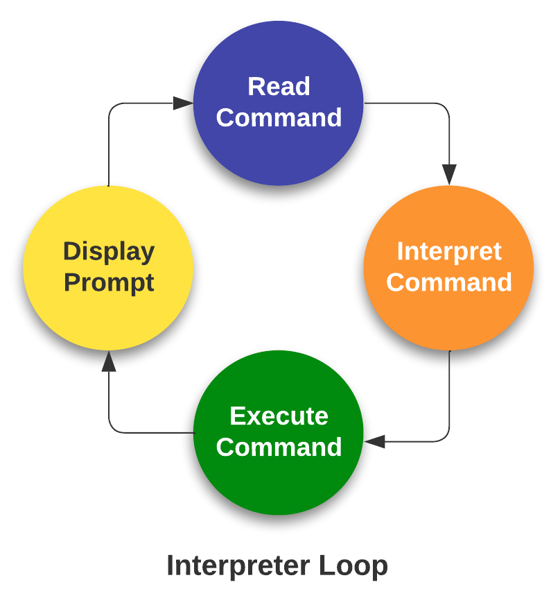

# 3. Scaling up your work

<center>{width="350"}</center>

## Introduction to HPC

### Defining high-performance computing

The simplest way of defining high-performance computing is by saying that it is the using of high-performance computers (HPC). However, this leads to our next question what is a HPC .

!!! info "HPC"

    A high-performance computer is a network of computers in a cluster that typically share a common purpose and are used to accomplish tasks that might otherwise be too big for any one computer.

<br>
<p>While modern computers can do a lot (and a lot more than their equivalents 10-20 years ago), there are limits to what they can do and the speed at which they are able to do this. One way to overcome these limits is to pool computers together to create a cluster of computers. These pooled resources can then be used to run software that requires more total memory, or need more processors to complete in a reasonable time.</p>

<p>One way to do this is to take a group of computers and link them together via a network switch. Consider a case where you have five 4-core computers. By connecting them together, you could run jobs on 20 cores, which could result in your software running faster.</p>

### HPC architectures

<p>Most HPC systems follow the ideas described above of taking many computers and linking them via network switches.  described above is:</p>
<br>

!!! info "What distinguishes a high-performance computer from the computer clusters"

    * The number of computers/nodes 
    * The strength of each individual computer/node 
    * The network interconnect – this dictates the communication speed between nodes. The faster this speed is, the more a group of individual nodes will act like a unit.


### NeSI Mahuika Cluster architecture

NeSI Mahuika cluster (CRAY HPE CS400) system consists of a number of different node types. The ones visible to researchers are:


* Login nodes
* Compute nodes

!!! info ""

    === "Overview of HPC Architecture"

        <br>
        {width="700"}
        <br>

    === "Composition of a node"

        <br><center>
        {width="500"}
        </center><br>

    === "In reality"

        <center>
        {width="700"}
        </center>


### From Hardware to Software

Over 90% HPCs & supercomputers employ Linux as their operating system.  Linux has four essential properties which make it an excellent operating system for the HPCs &  science community:

!!! quote ""

    
    === "Performance"
        Performance of the operating system can be optimized for specific tasks such as running small portable devices or large supercomputers.

    === "Functionality"
        A number of community-driven scientific applications and libraries have been developed under Linux such as molecular dynamics, linear algebra, and fast-Fourier transforms.

    === "Flexibility" 
        The system is flexible enough to allow users to build applications with a wide array of support tools such as compilers, scientific libraries, debuggers, and network monitors.

    === "Portability"
        The operating system, utilities, and libraries have been ported to a wide variety of devices including desktops, clusters, supercomputers, mainframes, embedded systems, and smart phones.

!!! info "The Linux operating system is made up of three parts; the ^^kernel^^, the ^^shell^^ and the software"

    Kernel − The kernel is the heart of the operating system. It interacts with the hardware and most of the tasks like memory management, task scheduling and file management.

    ^^**Shell**^^ − The shell is the utility that processes your requests (acts as an interface between the user and the kernel). When you type in a command at your terminal, the shell *interprets* (operating as in ^^*interpreter*^^) the command and calls the program that you want. The shell uses standard syntax for all commands. The shell recognizes a limited set of commands, and you must give commands to the shell in a way that it understands: Each shell command consists of a command name, followed by command options (if any are desired) and command arguments (if any are desired). The command name, options, and arguments, are separated by blank space. 

    - An ^^*interpreter*^^ operates in a simple loop: It accepts a command, interprets the command, executes the command, and then waits for another command. The shell displays a "prompt," to notify you that it is ready to accept your command.
    <center>
    {width="200"}
    </center>


### Accessing software via modules

On a high-performance computing system, it is quite rare that the software we want to use is available when we log in. It is installed, but we will need to “load” it before it can run.

Before we start using individual software packages, however, we should understand the reasoning behind this approach. The three biggest factors are:

* software incompatibilities
* versioning
* dependencies

One of the workarounds for this issue is Environment modules. A module is a self-contained description of a software package — it contains the settings required to run a software package and, usually, encodes required dependencies on other software packages.

There are a number of different environment module implementations commonly used on HPC systems and the one used in NeSI Mahuika cluster is `Lmod` where the `module` command is used to interact with environment modules.

**Common commands - module**

* View available modules

```bash
#View all modules
$ module avail

# View all modules which match the keyword in their name
$ module avail KEYWORD

# View all modules which match the keyword in their name or description
$ module spider KEYWORD
```
* Load a specific program

    >Note: All modules on NeSI have version and toolchain/environment suffixes. If none is specified, the default version for the tool is loaded. The default version can be seen with the module avail command.

```bash
$ module load MY_APPLICATION
```


* Unload all current modules

```bash
$ module purge
```
>Please **do not** use `$module --force purge`

* Swap a currently loaded module for a different one

```bash
$ module switch CURRENT_MODULE DESIRED_MODULE
```

---

<p style="text-align:left;">
    <b><a class="btn" href="https://genomicsaotearoa.github.io/Gene_Regulatory_Networks_Simulation_Workshop/workshop_material/02_getting_started_sismonr.html" style="background: var(--bs-green);font-weight:bold">&laquo; 2. Getting started with sismonr</a></b>
    <span style="float:right;">
     <b><a class="btn" href="https://genomicsaotearoa.github.io/Gene_Regulatory_Networks_Simulation_Workshop/workshop_material/04_working_with_job_scheduler.html" style="background: var(--bs-green);font-weight:bold">4. Working with job Scheduler &raquo;</a></b>
    </span>
</p>

<p align="center"><b><a href="https://genomicsaotearoa.github.io/Gene_Regulatory_Networks_Simulation_Workshop/">Back to homepage</a></b></p>
