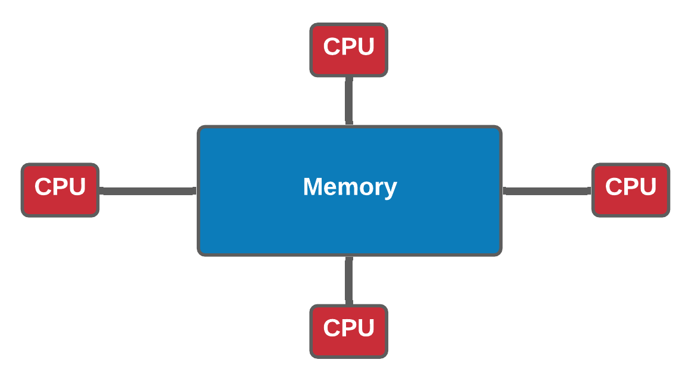

# 5. Parallel Job Arrays

## Introduction to parallel computing

STORY TIME !

Many scientific software applications are written to take advantage of multiple CPUs in some way. But often this must be specifically requested by the user at the time they run the program, rather than happening automatically.

The scheduler provides the simplest method for running parallel computations. SLURM schedules thousands of simultaneous calculations on NeSI clusters  and will gladly execute many of your jobs at once, as long as there are available resources.

This means, that in contrast to the language-specific parallelism methods required by shared memory ( OpenMP, etc. 😕), distributed memory (MPI,etc. 😕😕), and various threading  methods built into languages like Python, Matlab, and R, slurm can provide [embarassingly parallel](https://en.wikipedia.org/wiki/Embarrassingly_parallel) calculations. These calculations, more generously called “perfectly parallel” do not require any exchange of information between individual jobs which would otherwise require a high-speed network and intelligent algorithm for communicating these data. (🤔) They scale perfectly which means that twice as much calculation can be completed in the same amount of time with twice as much hardware. This is not always *true* for true or imperfect parallel calculations

!!! tip "😠"

    Shared memory, Distributed memory, OpenMP, MPI ? ....none of these terms are associated with Gene Regulation 😠 

    * Correct. However, these concepts/specifications in Parallel computing is important for the *scaling up* part of the workshop. 

    Okay, but can't we just call it witchcraft or black magic and move on ? 🧙‍♀️
    
    * Yes we can but this will help us with writing efficient, reliable code which can run in parallel. Therefore, let's spend a little bit of time going through theory and few exercises 🤓

---

??? abstract "Shared memory vs Distributed memory (Optional)"

     ---
     
     | Shared memory                                           | Distributed memory |
     |:-----                                                   |:----- |
     |In a shared memory model all processors have access to a pool of common memory that they can freely use.  | In a distributed memory model a separate segment of memory is available to each processor. Because memory isn’t shared inherently, information that must be shared between processes is sent over a network.|
     ||
     
     ---
     
     Let's break this down a bit by using the schematic use for illustrating HPC architecture 
     
     <br><center>
     {width="500"}
     </center><br>
     
     >*Analogy*
     >* Shared memory:
     >    * One very large whiteboard in a two-person office (the shared memory)
     >    * Two people working on the same problem (threads running on different cores attached to the memory)
     >    * How do they collaborate (working together but not interfering)
     >    * need *private* data
     >
     >* Distributed memory
     >    * Two whiteboards in different single-person offices (distributed memory)
     >    * Two people working on the same problem (processes on different nodes attached to the interconnect)
     >    * How do they collaborate (to work on a single problem)
     >    * Explicit communication (for example by phone. Also, no shared data)

 
??? abstract "Multi-threading (Optional)"


    Multi-threading is a method of parallelisation whereby the initial single thread of a process forks into a number of parallel threads, generally via a library such as OpenMP (Open MultiProcessing), TBB (Threading Building Blocks), or pthread (POSIX threads).

    Let's take a look at the difference between a serial job and a multi-threaded job

    <br>
    <center>{width="500"}</center>
    <br>
    <br>
    <center>{width="550"}</center>
    <br>

    ??? question "Exercise 5.1"

        Let's try out a multi-threading example script with OpenMP which is an application programming interface that supports multi-platform shared-memory 

        ```bash
        #confirm the working directory 
        $ pwd 
        /nesi/project/nesi02659/sismonr_workshop/workingdir/me123/

        #create a new directory for this episode, cd into it
        $ mkdir 5_parallel && cd 5_parallel

        #Create two more working directories for this exercise and the next one and change to `openmp` directory
        $ mkdir {openmp,mpi} && cd openmp

        #Copy the pre-compiled `omp_helloworld` to current working directory
        $ cp /nesi/project/nesi02659/sismonr_workshop/dev/openmp/omp_helloworld ./

        #use a text editor of choice to create a file named openmp_hw.sl - we will use nano here
        $ nano openmp_hw.sl
        ```
        **Content of `openmp_hw.sl` is as below**

        ```bash
        #!/bin/bash

        #SBATCH --account       nesi02659
        #SBATCH --job-name      openmp_helloworld
        #SBATCH --cpus-per-task 6
        #SBATCH --mem-per-cpu   100
        #SBATCH --output        openmp_hw_%j.out
        #SBATCH --export        none
        unset SLURM_MEM_PER_NODE
        export SLURM_EXPORT_ENV=ALL
        module purge

        export OMP_NUM_THREADS=${SLURM_CPUS_PER_TASK}

        srun ./omp_helloworld
        ```
        >**Explanation**
        ><p>Slurm by default doesn’t know what cores to assign to what process it runs. For threaded applications, you need to make sure that all the cores you request are on the same node.
        >
        >The OpenMP script is an example that all the cores are on the same node, and lets Slurm know which process gets the cores that you requested for threading.
        >
        >`OMP_NUM_THREADS` environment variable is used to specify the default number of threads to use in parallel regions. By adjusting the value of the `OMP_NUM_THREADS` environment variable, one can adjust the number of execution threads.</p>

        * Submit the script with `sbatch openmp_hw.sl` and review the content of  .out file *openmp_hw_jobid.out* upon completion .i.e.

        ```bash
        $ sbatch openmp_hw.sl
        ``` 


??? abstract "MPI (Message Passing Interface) - (Optional)"

    MPI is a specification for the developers and users of message passing libraries. By itself, it is NOT a library - but rather the specification of what such a library should be.

    MPI primarily addresses the message-passing parallel programming model: data is moved from the address space of one process to that of another process through cooperative operations on each process.

    Simply stated, the goal of the Message Passing Interface is to provide a widely used standard for writing message passing programs. The interface attempts to be:

    * Practical
    * Portable

    * Efficient
    * Flexible    
    
    ??? question "Exercise 5.2"

        Let's try out a MPI example 
    
        ```bash

        #make sure you have changed the current working directory to 5_parallel/mpi
        $ pwd 
        /nesi/project/nesi02659/sismonr_workshop/workingdir/me123/5_parallel/mpi

        #copy the pre-compiled mpi program to current working directory
        $ cp /nesi/project/nesi02659/sismonr_workshop/dev/mpi/mpi_helloworld ./

        #use a text editor of choice to create a file named mpi_hw.sl - we will use nano here
        $ nano mpi_hw.sl
        ```
        **Content of  `mpi_hw.sl` is as below**
        ```bash
        #!/bin/bash

        #SBATCH --account       nesi02659
        #SBATCH --job-name      mpi_helloworld
        #SBATCH --cpus-per-task 1
        #SBATCH --ntasks        6
        #SBATCH --nodes         2
        #SBATCH --mem-per-cpu   100
        #SBATCH --output        mpi_hw_%j.out

        module purge && module load OpenMPI/4.1.1-GCC-9.2.0

        srun ./mpi_helloworld
        ```
        >**Explanation**
        >`srun` command executes the program. The  `--ntasks` is the number of MPI processes to run.
        >
        >The script executed 6 processes and the incremented integer values in .out file will show the communication between the processes. These proocesses will be *distributed* across two compute nodes (`--nodes 2`).

        * Submit the script with `sbatch mpi_hw.sl` and review the content of  .out file *mpi_hw_jobid.out* upon completion .i.e.
         ```bash
        $ sbatch mpi_hw.sl
        ```

        **NOTE**: .out file will print 6 x  `Hello world from processor wbn125, rank 4 out of 6 processors` message (or something along those lines)
         `wbn125` - this is the compute node ID. It will be different for everyone as we have hundreds of compute nodes and this job will land on two (`--nodes 2`)  out of those hundreds. 
         `processor` - actual instance of the program that are running 

        * `rank` - MPI allows you to create logical **groups** of processes, and in each group, a process is identified by its **rank**. This is an integer in the range of [0,N-1] where N is the size of the group. 

In general, there are two advantages to running applications in parallel: (1) applications will run more quickly and we can get our solutions faster, and (2) we can solve larger, more complex problems.In an ideal world, if we increase the number of cores we are using by a factor of 10, we should be able to either get the solution to our current problem 10 times faster, or to run a system 10 times bigger in the same amount of time as now.


Unfortunately, this is often not the case…

### Strong vs. weak scaling

Scaling describes how the runtime of a parallel application changes as the number of processors is increased. Usually, there are two types of scaling of interest:

* **strong scaling** is obtained by increasing the number of processors P used for a problem of fixed size/complexity N. As the number of processors increases, the amount of work per processor should decrease.
* **weak scaling** is obtained by increasing both the number of processors and the system size/complexity, with both of these being increased at the same rate.

Ideally, for strong scaling, the runtime will keep decreasing in direct proportion to the growing number of processors used. For weak scaling, the ideal situation is for the runtime to remain constant as the system size, and number of processors used, are increased. In general, good strong scaling is more relevant for most scientific problems, but is also more difficult to achieve than weak scaling.

!!! info "Amdhal’s law and strong scaling"

    The limitations of strong scaling are best illustrated by Amdhal’s law: “The performance improvement to be gained by parallelisation is limited by the proportion of the code which is serial”. As more processors are used, the runtime becomes more and more dominated by the serial portion of a code.

    <br>
    <center>{width="490"}</center>
    <br>

!!! info "Gustafson’s law and weak scaling"

    Gustafson’s law provides a solution to the limitations of strong scaling described. The proposal is simply: we should run larger jobs on larger processor counts. If we run larger problems, then the parallelisable part of the problem will increase. We are still limited by the serial part of the code, but this becomes less important, and we can run on more processors more efficiently.

    <br>
    <center>{width="490"}
    <br>

#### Load imbalance

The laws and thoughts above only apply to cases where all processors are equally busy. What happens if some processors run out of work while others are still busy?

Scalibility isn’t everything! It’s also important to make the best use of all processors at hand before increasing the number of processors.


## Slurm job arrays

Job arrays offer a mechanism for submitting and managing collections of similar jobs quickly and easily; job arrays with millions of tasks can be submitted in milliseconds (subject to configured size limits). All jobs must have the same initial options (e.g. size, time limit, etc.)

In brief, Job arrays allow you to leverage Slurm’s ability to create multiple jobs from one script. Many of the situations where this is useful include:

* Establishing a list of commands to run and have a job created from each command in the list.
* Running many parameters against one set of data or analysis program.
* Running the same program multiple times with different sets of data. 

<br>
<center>{width="700"}</center>
<br>

??? question "Exercise 5.3"

    Let's start compiling our first slurm array script

    * Purpose is to execute the same `sleep 40 ` command we used in *Working with job scheduler* episode but we want to run five iterations of it 

    ```bash

    #Change the working directory to Exercise_5.3
    $ cd /nesi/project/nesi02659/sismonr_workshop/workingdir/$USER/Exercise_5.3

    #You should see a single .sl and a directory named slurmout
    $ ls -F 
    firstslurm_array.sl  slurmout/
    ```
    Content of `firstslurm_array.sl` should be as below. Please discuss as you make progress
    ```bash
    #!/bin/bash -e

    #SBATCH --account       nesi02659
    #SBATCH --job-name      first_slurm_Array
    #SBATCH --time          00:02:30
    #SBATCH --output        slurmout/sleeparray.%A.%a.out
    #SBATCH --cpus-per-task 1
    #SBATCH --mem           100
    #SBATCH --array         1-5

    ###Some Jupyter specific variabes to submit srun commands from Jupyter Terminal
    srun sleep 120

    echo "I am a slurm job and I slept for 120 seconds but this time in Parallel"
    echo "This is the result for ${SLURM_ARRAY_TASK_ID}"
    ```

    >Let's review some of those new slurm directives and variables prior to submitting the script
    > * Job arrays are only supported for batch jobs and the array index values are specified using the `--array` or `-a` option. This is the most important directive in an array script
    > * .out filename %A and %a where : %A will be replaced by the value of `SLURM_ARRAY_JOB_ID` (will be set to the first job ID of the array)  and %a will be replaced by the value of `SLURM_ARRAY_TASK_ID`(will be set to the job array index value). Let's review the meaning of these two variables after submitting the job

    * Once you submit the job with `sbatch firstslurm_array.sl`, take a note of the jobid and run the command `squeue -j jobid`. For an example, let's use the hypothetical job id 23284978 and view the output

    ```bash
    $ squeue -j 23284978

    JOBID         USER     ACCOUNT   NAME        CPUS MIN_MEM PARTITI START_TIME     TIME_LEFT STATE    NODELIST(REASON)    
    23284978_1    me123  nesi02659 first_slurm_   2    100M large   Nov 28 09:26        0:57 RUNNING  wbn094              
    23284978_2    me123  nesi02659 first_slurm_   2    100M large   Nov 28 09:26        0:57 RUNNING  wbn094              
    23284978_3    me123  nesi02659 first_slurm_   2    100M large   Nov 28 09:26        0:57 RUNNING  wbn096              
    23284978_4    me123  nesi02659 first_slurm_   2    100M large   Nov 28 09:26        0:57 RUNNING  wbn096              
    23284978_5    me123  nesi02659 first_slurm_   2    100M large   Nov 28 09:26        0:57 RUNNING  wbn096   
    ```

    * Once the job is completed, take a look at the `slurmout/` directory. There should be 5 x .out files


??? question "Exercise 5.4"


    Objective of this exercise is to to run slurm array with two indexes each running 2 simulations.  
    ```bash
    #Change working directory to Exercise_5.4
    $ cd /nesi/project/nesi02659/sismonr_workshop/workingdir/$USER/Exercise_5.4 

    #Run ls command you should 2 files and a directory named slurmout
    $ ls -F
    250sims_2arrayindex.sl  simulate_colsystem_array_2sim.R  slurmout/

    #use cat command to view the content of slurm script 250sims_2arrayindex.sl(or open it via nano, vim or another text editor)
    $ cat 250sims_2arrayindex.sl
    ```

    Let's review some of those new slurm directives and variables prior to submitting the script
     * Job arrays are only supported for batch jobs and the array index values are specified using the `--array` or `-a` option. This is the most important directive in an array script
     * .out filename %A and %a where : %A will be replaced by the value of `SLURM_ARRAY_JOB_ID` (will be set to the first job ID of the array)  and %a will be replaced by the value of `SLURM_ARRAY_TASK_ID`(will be set to the job array index value). Let's review the meaning of these two variables after submitting the job
    Content of `250sims_2arrayindex.sl` should be as below. Please discuss as you make progress

    ```bash
    #!/bin/bash -e

    #SBATCH --account       nesi02659
    #SBATCH --job-name      simulations_250_test             
    #SBATCH --time          00:15:00                 
    #SBATCH --mem           2GB 
    #SBATCH --cpus-per-task 2                    
    #SBATCH --array         1-2
    #SBATCH --output        slurmout/sims_250_test_%A_%a.out # Include the array ID in the names of
    #SBATCH --error         slurmout/sims_250_test_%A_%a.err # the output and error files


    ###Some processes can generate temporary files which can be redirected from RAM memory to scratch(nobackup) to reduce the Memory footprint
    export TMPDIR=/nesi/nobackup/nesi02659/tmp/tmp_${SLURM_JOB_ID}_${SLURM_ARRAY_TASK_ID}
    mkdir -p $TMPDIR

    #Sismonr specific variable
    export GROUP_ID=1.01

    module purge
    module load sismonr/2.0.0-gimkl-2020a-R-4.1.0

    srun Rscript simulate_colsystem_array_2sim.R
    ```

    * Submit the script with  `sbatch 250sims_2arrayindex.sl`, take a not on the jobid and run the command `squeue -j jobid`. 
    * Take a look at the content of *.out* and *.err* files in *slurmout* directory
    * If all goes well, job should run within 10 minutes and will generate two *.RData* files in current working directory .i.e. `Exercise_5.4`

    ```
    simulation_1_group1.01.RData
    simulation_2_group1.01.RData
    ```

### Exercise 5.5 (Group)


>* Host will assign you to a breakout room (zoom) or a group. 
>* Given the time constraint and the amount of resources required to run all of the simulations, each group will submit a **single** array job with 250 indexes.
>* Start with changing the working directory to `Exercise_5.5`
>* As a group, write a slurm script based on `250sims_2arrayindex.sl` from Exercise 5.4 to run 250 arrays. Also, don't forget that you do need a copy of the `simulate_colsystem_array_2sim.R` in current workig directory (OR use the relative/absolute path of working directory from previous exercise) Double check...Triple check before submission. 🙂
>* Then, choose **one person** in the group who will submit the job. The simulations output should be created in the working directory of the person who submitted the job. In the next section, the other members of the group will have to copy these output files for the post-processing step.(Or the instructors will provide a copy for you)





---

<p style="text-align:left;">
    <b><a href="https://genomicsaotearoa.github.io/Gene_Regulatory_Networks_Simulation_Workshop/workshop_material/04_working_with_job_scheduler.html">&laquo;  4. Working with job scheduler</a></b>
    <span style="float:right;">
     <b><a href="https://genomicsaotearoa.github.io/Gene_Regulatory_Networks_Simulation_Workshop/workshop_material/06_post_processing.html">6. Post-processing &raquo;</a></b>
    </span>
</p>

<p align="center"><b><a href="https://genomicsaotearoa.github.io/Gene_Regulatory_Networks_Simulation_Workshop/">Back to homepage</a></b></p>
