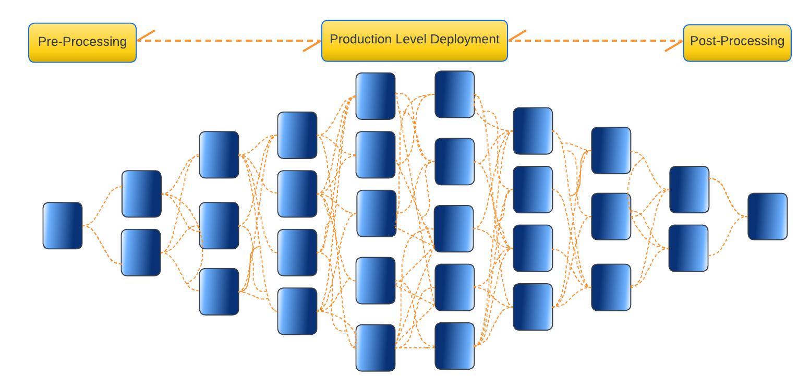

# 6. Post-processing

<center>{width="700"}</center>

## Checking that the job array worked

In the previous section, you have seen how to run a slurm array job. Now it is time to check whether the arrays completed without failing! And if some of the arrays did fail, we would like to identify them to re-run them.

As we have seen in the previous sections, the `sacct` command is useful to assess the status of submitted jobs. However, especially if you have many arrays, it can get difficult to find what you are looking for in the output. Fortunately, there is a (rather lengthy) command which allows you to obtain the ID of the arrays that failed in a format compatible with slurm. The advantage is that you can directly copy the output of this command and paste it in your slurm script for the `array` option, in order to re-run only those arrays that failed. Type the following command in the terminal:

```bash
$ sacct -j $JOB_ID -X -n -s TO,F,OOM -o jobid | cut -d "_" -f2 | tr -s ' \n' ','
```

In the command, you'll need to replace `$JOB_ID` by your actual slurm job ID.

Your turn! Did any of your arrays failed? If so, what would you change before re-running them?

!!! info "**Index**" 
    * `TO` = Timed Out
    * `F` = Failed
    * `OOM` = Out Of Memory

## Interpreting the sismonr output

Now, it is time to analyse the simulations that we generated. 

### Copying the simulation outputs to relevant directory

In the simulation script, we made sure to save each simulation into a `.RData` file. First, make sure that you are in the appropriate directory by typing in the terminal:

```bash
$ pwd
/nesi/project/nesi02659/sismonr_workshop/workingdir/me123/Exercise_5.5
```

If you do not have results, you can copy the backup files with:

```bash
$ cp /nesi/project/nesi02659/sismonr_workshop/backup_simulations/simulation_* /nesi/project/nesi02659/sismonr_workshop/workingdir/me123/Exercise_5.5/
```

of course replacing `me123` with your own username.

### Looking at one simulation output

Start a new sismonr Jupyter Notebook in the folder containing the simulations output. In the first cell, add and execute:

```r
library(sismonr)
library(tibble)
library(dplyr)
library(stringr)
library(purrr)
library(ggplot2)
```

A single `.rds` file can be then loaded into R with:

```r
sim <- readRDS("simulation_1_group1.RData")
```

The output of sismonr is a list composed of 3 elements:

* `Simulation`: a data-frame with the simulation results. Columns `time`, `Ind` and `trial` indicate the time (in seconds) in the simulation, *in silico individual* and trial (i.e. repeat of the simulation), respectively. The remaining columns each correspond to one molecular species present in the simulated system, and the values correspond to their abundance for the given time, individual and trial;

* `runningtime`: a vector giving, for each *in silico* individual, the running time (in seconds) of the simulations (across all trials);

* `stochmodel`: a Julia proxy object, giving the stochastic model used for the simulation. You probably won't ever need to work with this object.

We are only interested in the `Simulation` data-frame.

If you try to load one of your simulation files and have a look at this data-frame, it should look something like this (note that I'm using `as_tibble()` to get a nicer visualisation of the data-frame):

```r
as_tibble(sim$Simulation)
```

``` r
# A tibble: 4,804 × 203
    time trial R1GCN1 P1GCN1 R4GCN2 P4GCN2 R5GCN2 P5GCN2 R6GCN1 P6GCN1 R2GCN2 P2GCN2 R7GCN2 P7GCN2 R5GCN1 P5GCN1 R3GCN1 P3GCN1 R4GCN1 P4GCN1 R3GCN2 P3GCN2
   <dbl> <dbl>  <dbl>  <dbl>  <dbl>  <dbl>  <dbl>  <dbl>  <dbl>  <dbl>  <dbl>  <dbl>  <dbl>  <dbl>  <dbl>  <dbl>  <dbl>  <dbl>  <dbl>  <dbl>  <dbl>  <dbl>
 1     0     1      0      0      0      0      0      0      0      0     10    100      0      0      0      0     50    500      0      0     50    500
 2     1     1      4      0      0      0      0      0      0      0     10      0      1      0      0      0     50    445      0      0     51    455
 3     2     1      7      0      0      0      0      0      0      0      9      0      2      0      0      0     51    444      0      0     52    457
 4     3     1     13      0      0      0      0      0      0      0     10      0      4      0      0      0     51    448      0      0     52    453
 5     4     1     21      1      0      0      0      0      0      0     10      0      6      0      0      0     51    447      0      0     53    452
 6     5     1     22      2      0      0      0      0      1      0     10      0      7      0      0      0     50    448      0      0     52    453
 7     6     1     24      0      0      0      0      0      1      0     10      0      7      0      0      0     50    446      0      0     52    454
 8     7     1     25      0      0      0      0      0      2      0     10      1      7      0      0      0     50    447      0      0     52    454
 9     8     1     28      1      0      0      0      0      2      0     10      0      7      0      0      0     51    446      0      0     51    456
10     9     1     34      0      0      0      0      0      2      0     10      0      7      0      0      0     50    445      0      0     51    457
# … with 4,794 more rows, and 181 more variables: R2GCN1 <dbl>, P2GCN1 <dbl>, R1GCN2 <dbl>, P1GCN2 <dbl>, R7GCN1 <dbl>, P7GCN1 <dbl>, R6GCN2 <dbl>,
#   P6GCN2 <dbl>, CTC1_P2GCN1_P2GCN1 <dbl>, CTC1_P2GCN1_P2GCN2 <dbl>, CTC1_P2GCN2_P2GCN1 <dbl>, CTC1_P2GCN2_P2GCN2 <dbl>, CTC5_P4GCN1_P4GCN1 <dbl>,
#   CTC5_P4GCN1_P4GCN2 <dbl>, CTC5_P4GCN2_P4GCN1 <dbl>, CTC5_P4GCN2_P4GCN2 <dbl>, CTC2_P1GCN1_P1GCN1 <dbl>, CTC2_P1GCN1_P1GCN2 <dbl>,
#   CTC2_P1GCN2_P1GCN1 <dbl>, CTC2_P1GCN2_P1GCN2 <dbl>, CTC6_P3GCN1_CTC5_P4GCN1_P4GCN1 <dbl>, CTC6_P3GCN1_CTC5_P4GCN1_P4GCN2 <dbl>,
#   CTC6_P3GCN1_CTC5_P4GCN2_P4GCN1 <dbl>, CTC6_P3GCN1_CTC5_P4GCN2_P4GCN2 <dbl>, CTC6_P3GCN2_CTC5_P4GCN1_P4GCN1 <dbl>,
#   CTC6_P3GCN2_CTC5_P4GCN1_P4GCN2 <dbl>, CTC6_P3GCN2_CTC5_P4GCN2_P4GCN1 <dbl>, CTC6_P3GCN2_CTC5_P4GCN2_P4GCN2 <dbl>,
#   CTC3_P3GCN1_CTC1_P2GCN1_P2GCN1 <dbl>, CTC3_P3GCN1_CTC1_P2GCN1_P2GCN2 <dbl>, CTC3_P3GCN1_CTC1_P2GCN2_P2GCN1 <dbl>, …
```
 
Notice that each species has a suffix on the form `GCN1` or `GCN2`. This is because sismonr tracks the allele of origin of each molecule. As we are simulating a diploid system, each gene is present in 2 copies (two alleles), and so the RNAs and proteins of a given gene can originate from either of these two alleles. This can be really handy when looking at the impact of mutations of different alleles. In this case however, we don't care about the allele of origin of the different species. Instead, we would rather have the abundance of all RNAs or proteins for a given gene into one column. To obtain that, we can use the sismonr function `mergeAlleleAbundance`:

```r
merged_simulation <- mergeAlleleAbundance(sim$Simulation)
```

```r
as_tibble(merged_simulation)
```

``` r
# A tibble: 4,804 × 27
    time trial Ind      R1    P1    R4    P4    R5    P5    R6    P6    R2    P2    R7    P7    R3    P3  CTC1  CTC5  CTC2  CTC6  CTC3  CTC7  CTC8  CTC4
   <dbl> <dbl> <chr> <dbl> <dbl> <dbl> <dbl> <dbl> <dbl> <dbl> <dbl> <dbl> <dbl> <dbl> <dbl> <dbl> <dbl> <dbl> <dbl> <dbl> <dbl> <dbl> <dbl> <dbl> <dbl>
 1     0     1 Ind1      0     0     0     0     0     0     0     0    20   200     0     0   100  1000     0     0     0     0     0     0     0     0
 2     1     1 Ind1     14     0     0     0     0     0     0     0    20     1     1     0   101   900     0     0     0     0   100     0     0     0
 3     2     1 Ind1     16     1     0     0     0     0     0     0    19     1     2     0   103   901     0     0     0     0   100     0     0     0
 4     3     1 Ind1     25     0     0     0     0     0     0     0    20     2     4     0   103   901     1     0     0     0    98     0     0     1
 5     4     1 Ind1     32     1     0     0     0     0     0     0    20     2     6     0   104   899     0     0     0     0    96     0     0     4
 6     5     1 Ind1     39     2     0     0     0     0     1     0    18     0     8     0   102   901     1     0     0     0    96     0     0     4
 7     6     1 Ind1     40     0     0     0     0     0     1     0    18     0     8     0   102   900     0     0     0     0    95     0     0     4
 8     7     1 Ind1     46     1     0     0     0     0     2     0    18     1     9     0   102   901     0     0     0     0    94     0     0     6
 9     8     1 Ind1     54     2     0     0     0     0     2     0    18     1    10     0   102   902     0     0     0     0    93     0     0     7
10     9     1 Ind1     65     0     0     0     0     0     3     0    18     1    10     0   101   902     0     0     0     0    90     0     0    10
# … with 4,794 more rows, and 2 more variables: CTC9 <dbl>, CTC10 <dbl>
```
 
This time, we have one column for the RNA abundance of each gene, and idem for the proteins and regulatory complexes. This will be much more practical to create some plots.

One more thing to note: in each simulation output, the `trial` column will be filled with `1` and `2`. This is something to keep in mind when we'll load all the simulation outputs, as ideally we would like to have values from `1` to `500`. The good news is, we can extract the array ID of a given simulation from the file name, using:

```r
str_extract("simulation_10_group1.rds", "(?<=_)\\d+(?=_)") |>
  as.numeric()
```

```r
10
```

Once we have the array ID of a given file name, we can use a little trick to replace the `1` and `2` in the trial column, as follows:

```
  Array ID  trial    Simulation index
         1      1                   1
                2                   2
         2      1                   3
                2                   4
         3      1                   5
                2                   6
         4      1                   7
                2                   8
etc.
```
 
 this conversion is obtained via the formula: `Simulation index = trial + 2 x (Array ID - 1)`.

## Importing all simulation results in R

The challenge here is we don't have only 1 `.rds` file; in fact, we've just created 250 of them per group! We will need to use a loop of some sort to import all simulations in R.

### Listing all the simulation files

The first thing we need is a list of all simulation files. There is a function in R just for that: `list.files`. It will list all files present in the given directory that match a specific pattern.

```r
## Don't forget to update the pattern to reflect how you named your simulation outputs
## For example, replace 'group1' by your group ID
sim_files <- list.files(path = "./", pattern = "_group1.rds")
head(sim_files)
```

```r
[1] "simulation_1_group1.rds"   "simulation_10_group1.rds"  "simulation_100_group1.rds" "simulation_101_group1.rds"
[5] "simulation_102_group1.rds" "simulation_103_group1.rds"
```

You can check that there are 250 files:

```r
n_sim <- length(sim_files)
n_sim
```

```r
250
```

### Creating a loop to import all simulations

To import each of these simulations, we could use a basic `for` loop, which would look something like this:


!!! warning "**Do not run!**" 
    ```r
    sim_df <- c()
    for(file in sim_files){
      sim <- readRDS(file)
      sim_df <- bind_rows(sim_df, sim$Simulation)
    }
    ```


Which is really not ideal from a memory and computational time perspective. However, there is a nice alternative, which relies on the package `purrr`. Specifically, purrr provides a function, `map_dfr`, which applies a function to each element of a vector, and concatenates the results into a data-frame. In our case, we can write a function that reads in and formats the simulations result given the file name: 

```r
read_simulation_results <- function(file){
  
  ## Reading in the simulation result
  sim <- readRDS(file)

  ## Extract the simulation array number
  sim_id <- str_extract(file, "(?<=_)\\d+(?=_)") |>
              as.numeric(sim_id)
    
  ## Merge abundance of the two alleles of a gene
  ## and adjust the trial ID
  res <- mergeAlleleAbundance(sim$Simulation) |>
            as_tibble() |>
            mutate(trial = trial + 2 * (sim_id - 1))
    
  return(res)
}
```

We can then apply this function to each file name (stored in the `sim_files` vector). As the function returns a data-frame, we can use `map_dfr()` which:

* applies the `read_simulation_results()` function to each element of the `sim_files` vector;

* concatenate the returned data-frames into one data-frame.

```r
sim_df <- map_dfr(sim_files, read_simulation_results)
```

The resulting data-frame `sim_df` should have 1,201,000 rows:

```r
sim_df
```

```r
# A tibble: 1,201,000 × 27
    time trial Ind      R1    P1    R4    P4    R5    P5    R6    P6    R2    P2    R7    P7    R3    P3  CTC1  CTC5  CTC2  CTC6
   <dbl> <dbl> <chr> <dbl> <dbl> <dbl> <dbl> <dbl> <dbl> <dbl> <dbl> <dbl> <dbl> <dbl> <dbl> <dbl> <dbl> <dbl> <dbl> <dbl> <dbl>
 1     0     1 Ind1      0     0     0     0     0     0     0     0    20   200     0     0   100  1000     0     0     0     0
 2     1     1 Ind1     13     0     0     0     0     0     0     0    20     1     0     0    99   901     0     0     0     0
 3     2     1 Ind1     24     1     0     0     0     0     0     0    20     1     1     0    97   901     0     0     0     0
 4     3     1 Ind1     37     1     0     0     0     0     0     0    20     1     2     0    98   902     1     0     0     0
 5     4     1 Ind1     40     1     0     0     0     0     0     0    20     0     1     0    98   901     0     0     0     0
 6     5     1 Ind1     48     1     1     0     0     0     1     0    20     0     4     0   101   900     0     0     1     0
 7     6     1 Ind1     51     1     1     0     0     0     1     0    20     1     4     0   101   904     0     0     1     0
 8     7     1 Ind1     61     2     2     1     0     0     1     0    20     1     4     0   102   900     0     0     0     0
 9     8     1 Ind1     62     1     2     1     0     0     0     0    20     1     5     0   102   901     1     0     0     0
10     9     1 Ind1     60     3     3     1     0     0     0     0    20     0     5     0    99   900     1     0     0     0
# … with 1,200,990 more rows, and 6 more variables: CTC3 <dbl>, CTC7 <dbl>, CTC8 <dbl>, CTC4 <dbl>, CTC9 <dbl>, CTC10 <dbl>
# ℹ Use `print(n = ...)` to see more rows, and `colnames()` to see all variable names
```

## Visualising the simulations

Now that we have all 500 simulations into one data-frame, we can easily visualise them! We'll start by using the `plotSimulation` function from sismonr. We first have to load the `sismonr_anthocyanin_system.RData` object, which contains the correspondence between species IDs and names, and the colours that we want to use for the plot:

```r
load("~/sism/sismonr_anthocyanin_system.RData")
```

```r
plotSimulation(sim_df,
               molecules = names(colours),
               mergeComplexes = FALSE,
               labels = id2names[names(colours)],
               colours = colours)
```


This should look very similar to the first plot we've made of the result of one simulation. This time however, the average abundance of a given species across all simulations is given with a solid line, and the minimum and maximum abundance across the simulations is represented as a shaded area. This plot is really useful to visualise the biological variation that could be observed experimentally for genetically identical plants.

## Comparing DFR expression between the two plants

One of the interesting results from these simulations is that we can confirm that the expression of anthocyanin biosynthesis-related genes is reduced in the mutant plant. We can visualise it, by creating a graph (say, a histogram, although a boxplot or density plot would work just as well) of the DFR protein abundance at t = 20 minutes (t = 1,200s) in the two plants. As a reminder, the DFR gene is gene 7 in our sismonr GRN. In the simulation data-frame, the column `R7` corresponds to the RNAs of gene 7, and the column `P7` corresponds to the proteins of gene 7.

Have a go at it first! When you are ready, one possible plot is presented below:

??? example

    ```r
    sim_df %>% 
      filter(time == 1200) %>% ## only keep the last time point of each simulation
      select(trial, Ind, "P7") %>% ## we want to focus on DFR proteins abundance 
      ## for a better plot, show wild-type plant first, and give each individual a nice label 
      ## (rather than "Ind1" and "Ind2")
      mutate(Ind = factor(Ind, 
                          levels = c("Ind1", "Ind2"), 
                          labels = c("Wild-type", "MYBrep overexpressed"))) %>% 
      ## Plot section:                    
      ggplot(aes(x = P7, fill = Ind)) + 
      geom_histogram(alpha = 0.5, colour = "gray20", bins = 50) + ## alpha = transparency of the bars
      scale_fill_brewer(palette = "Set1", direction = -1) + ## choose nice colours
      labs(x = "DFR protein abundance", ## x axis title
           y = "Count (simulations)", ## y axis title
           fill = "Plant", ## colour legend title
           title = "DFR expression is reduced in mutant plants", ## informative title
           subtitle = "Results from 500 simulations") + ## and subtitle
      theme_bw() + ## white background, black axes, etc
      theme(legend.position = "bottom",
            plot.title = element_text(hjust = 0.5),    ## center the title
            plot.subtitle = element_text(hjust = 0.5), ## and the subtitle
            text = element_text(size = 18))            ## and increase font size  
    ```

    


## Conclusion

Yay, you've reached the end of this workshop! Feel free to make use of this knowledge in your own research projects :)

---


<p align="center"><b><a href="https://genomicsaotearoa.github.io/Gene_Regulatory_Networks_Simulation_Workshop/">Back to homepage</a></b></p>
