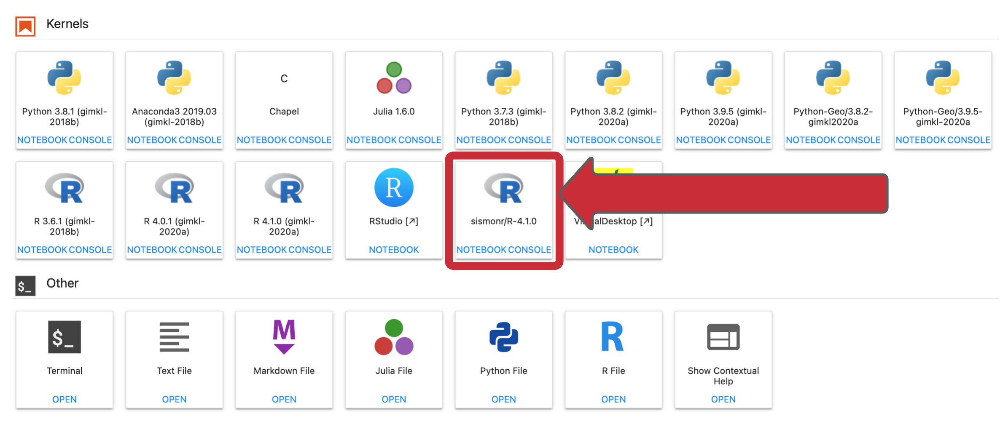

# Supplementary


??? tip "S.1.NeSI Mahuika Jupyter login"


     1. <p>Follow [https://jupyter.nesi.org.nz/hub/login](https://jupyter.nesi.org.nz/hub/login)</p>
     2. <p>Enter NeSI username, HPC password and 6 digit second factor token <br></p>
     3. <p>Choose server options as below
     
     >>* make sure to choose the correct project code `nesi02659`, number of CPUs `CPUs=4`, memory `8 GB` prior to pressing {width="50"} button.
     
     <br>
 

??? tip "S.2.Opening a Jupyter teminal, create a working directory, switch Jupyter file explorer to correct path and open sismonr Jupyter kernel (sismonr/R-4.1.0)" 

     1. <p>Start a terminal session from the JupyterLab launcher<br>{width="500"}</p>
     
         * <p>When you connect to NeSI JupyterLab you always start in a new hidden directory. To make sure you can find your work next time, you should change to another location. Here we will create a working directory in project nesi02659 workspace for each attendee and then create a symlink from home (~) for easy access.</p> 
         
         ```bash
         cd ~
         mkdir -p /nesi/project/nesi02659/sismonr_workshop/workingdir/$USER
         ln -s  /nesi/project/nesi02659/sismonr_workshop/workingdir/$USER ~/sism_2021
         ```
         
     2. <p>Guide Jupyter file explorer (left panel) to above working directory<br></p> 
     
     3. <p>Open 'sismonr/R-4.1.0 kernel'<br>{width="500"}</p>

??? tip "S.3.Restart Jupyter Server Session" 

    Only in an instance where the current session was not started according to the instructions on **S.1.** (above) OR the current session is completely unresponsive 

    <br>
    <center>{width="1000"}</center>
    <br>

## S.4.Local setup

The sismonr package depends on the programming language [Julia](https://julialang.org/). It is preferable to install Julia on your computer before installing sismonr.

### Installing Julia
To install Julia, go to [https://julialang.org/downloads/](https://julialang.org/downloads/) and follow the instructions. The sismonr package currently works with version >= 1.0.

Please make sure to include the Julia executable in your environmental variable PATH. **Linux users** can use the following command in the terminal:
```
sudo ln -s path_to_julia_folder/bin/julia /usr/local/bin/julia
```
to create a symbolic link to julia inside the `/usr/local/bin` folder.

**Windows users** can open the Control Panel and go to System > Advanced system settings > Environment variables. Select the PATH variable, click on Edit > New and copy-paste the path `path_to_julia_folder/bin`.

You may need to restart your computer.

### Installing sismonr

sismonr is available on the CRAN. You can install sismonr from R or Rstudio using the following commands:

```r
install.packages("sismonr")
```

Alternatively, to download the latest development version, you can use:

```r
library(devtools)
install_github("oliviaAB/sismonr")
```
---

<p align="center"><b><a href="https://genomicsaotearoa.github.io/Gene_Regulatory_Networks_Simulation_Workshop/">Back to homepage</a></b></p>
