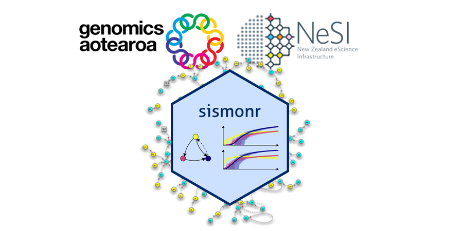

# **Scaling Gene Regulatory Networks Simulations**

## Prerequisites

- Familiarity with bash and R
- Basic molecular biology knowledge preferred (gene expression and regulation)
- HPC knowledge preferred

- - -

## Learning objectives

By the end of this workshop, participants should be able to:

!!! quote ""

    - explain the concept of modelling and simulations, and how simulations can help answer research questions;
    - briefly describe the main steps of gene expression, and explain what is a Gene Regulatory Network;
    - list several classes of GRN models;
    - generate a small random GRN with the sismonr package and simulate the expression of its gene;
    - submit and manage jobs on a cluster using a scheduler and use software through environment modules;
    - automate a large number of tasks on a HPC using array jobs.

- - - 

## Some of the things we won't cover in this workshop 🙅

- How to : 
    - construct a mathematical or statistical model for a specific biological system of interest;
    - estimate model parameters based on experimental data;
    - reconstruct a GRN from experimental data;
- Any questions we don't have an answer for 🤦

- - -

## Content

Before getting started, have a look at the [Supplementary data](./07_supplementary.md) for instructions on how to connect to NeSI Mahuika Jupyter.

| **Lesson**                                         | **Overview** | 
|:---------------------------------------------------|:-------------|
|[1. Introduction](./01_introduction.md){ .md-button .md-button--primary }                          | General overview of Simulations , Gene Regulatory Networks and Simulating Gene Regulatory networks |
|[2. Getting started with sismonr](./02_getting_started_sismonr.md){ .md-button .md-button--primary }|Describe how `sismonr` package works and running the first simulation|
|[3. Scaling up your work](./03_scaling_up.md){ .md-button .md-button--primary }| Introduction to High Performance Computing|
|[4. Working with job scheduler](./04_working_with_job_scheduler.md){ .md-button .md-button--primary }|Introduction to HPC Job Schedulers, Slurm Scheduler & life cycle of a Slurm job, Assessing resource utilisation and profiling|
|[5. Parallel job arrays](./05_parallel_job_arrays.md){ .md-button .md-button--primary }|Introduction to specifications in Parallel Computing, Slurm Job arrays and Exercises on Scaling networks|
|[6. Post-processing](./06_post_processing.md){ .md-button .md-button--primary }|Interpreting `sismonr` output and Visualising the simlulations|
|[7. Supplementary-material.1](./07_supplementary.md){ .md-button}||
|[8. Supplementary-material.2](./08_supplementary_2.md){.md-button}||

- - -

## Schedule

| Day      | Time           | Topic                                                          |
|----------|----------------|----------------------------------------------------------------|
| 1st day: | 10am-12:30pm   | 1. Introduction                                                |
|          | 12:30pm-1:30pm | *Lunch break*                                                  |
|          | 1:30pm-2:30pm  | 2. Getting started with sismonr                                |
|          | 2:30pm-3.30pm     | 3. Scaling up your work 4. Working with job scheduler       |
| 2nd day: | 10am-12pm      | 5. Automating large number of tasks                            |
|          | 12pm-1pm       | *Lunch break*                                                  |
|          | 1pm-2.30pm        | 5. Post-processing                                             |
|          | 2.30pm -        | Question time                                                  |
