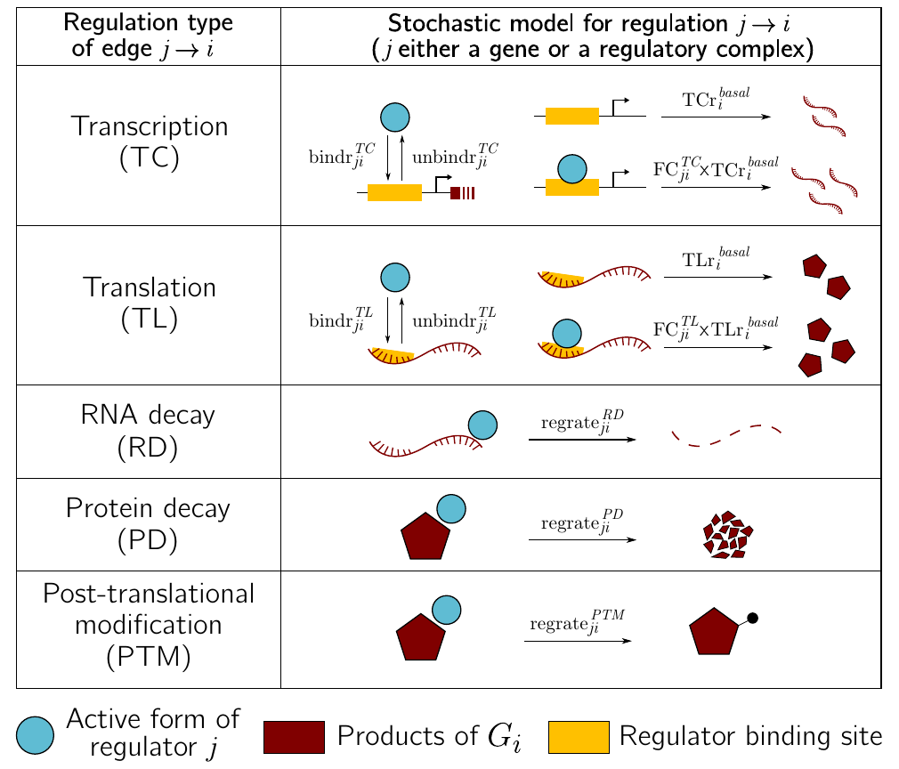
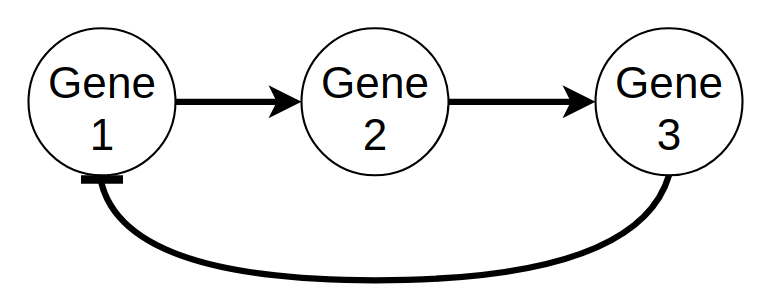

This advanced workshop is an introduction to the stochastic simulation of Gene Regulatory Networks (GRNs) using the R package `sismonr`. You will learn the basics of simulating GRNs, and how to scale up simulations on a HPC.

## Pre-workshop information

## Prerequisites

- Familiarity with bash and R
- Basic molecular biology knowledge preferred (gene expression and regulation)
- HPC knowledge preferred

## Learning goals

## Schedule

## Outline (draft)

1. [Introduction](#introduction)
    1. [Why are simulations important in research?](#why-are-simulations-important-in-research)
    2. [What are Gene Regulatory Networks?](#what-are-gene-regulatory-networks)
    3. [Simulating Gene Regulatory Networks](#simulating-gene-regulatory-networks)
    4. A (brief introduction of the Stochastic Simulation Algorithm)
    5. The sismonr package
2. The research question
    1. The topic (simulation of anthocyanin biosynthesis pathway)
    2. Setting on local machine
    3. The main steps of a scaling project
3. First steps on the HPC
    1. Loading modules (R and Julia)
    4. Running a test script
4. Scaling up your work
    1. Assessing time and memory usage
    2. profiling code
5. Parallel computing on NeSI
    1. Introduction to parallel computing
    2. How to execute parallel code on NeSI
6. Post-processing
    1. Analysing the output


## Introduction

### Why are simulations important in research?

### What are Gene Regulatory Networks?

#### An overview of gene expression

The instructions necessary to a cell's functioning are encoded in its DNA, which is composed of two anti-parallel chains of nucleotides, intertwined into a double helix. Some portions of this DNA molecule, termed protein-coding genes, contain instructions about the synthesis of proteins, which are important molecular actors fulfilling essential roles in the cell. The complex multi-step process of decoding this information and using it to produce proteins is what we call gene expression. Briefly, gene expression involves:

1. Transcription: the sequence of nucleotides that forms the gene is copied into a "free-floating" version called messenger RNA (mRNA), as the result of a complex series of biochemical interactions involving enzymes and other molecules.
2. Translation: the messenger RNA is used as a template to create proteins; each consecutive triplet of nucleotides is translated into a specific amino acid (the building blocks of proteins). The correspondence between triplets of nucleotides and amino acids is known as the genetic code. A sequence of amino acids is thus created from the messenger RNA template, and, once completed, constitutes the synthesised protein.
3. Post-translational modifications: once synthesised, a protein may have to undergo some transformations before attaining its functional state. Such modifications include changes in conformation (i.e. the way in which the sequence of amino acids is folded in the 3D space), cleavage of a portion of the amino acid sequence, addition of molecular signals to specific amino acids, or binding to other proteins to form protein complexes.


<small>Image credit: Fondation Merieux</small>
    

#### Regulation of gene expression

Cells respond and adapt to changes in the environment or other inter- and intra-cellular cues by modulating the expression of their genes, which affects the pool of available proteins. Regulation of gene expression can be achieved by different types of molecular actors: proteins encoded by other genes, regulatory non-coding RNAs (i.e. molecules of RNAs that are not used to produce proteins), or even metabolites.

Regulators can control the expression of a given target gene by affecting different steps of the target's expression:

- Regulation of transcription: this is the most-studied type of gene expression regulation. The regulatory molecule (a protein that regulates transcription are called a transcription factor) controls the production of messenger RNAs from the target gene.
- Regulation of translation: the regulatory molecule controls the rate at which target mRNAs are translated to synthesise proteins.
- Decay regulation: the regulatory molecule affects the rate at which the target mRNAs or proteins are degraded.
- Post-translational regulation: the regulator modifies the shape or sequence of its target proteins, thus affecting the ability of the target protein to perform its cellular function.

Regulators that increase the expression of their target are called activators; those decreasing the expression of their target are called repressors. Typically, the relationship between regulator and target is quite specific, with most regulators controlling the expression of only a few target genes, and most genes being controlled by a small set of regulators. 

As scientists gain knowledge into the regulatory relationships between genes, they summarisethis information into graphs, which we call Gene Regulatory Networks (GRN). In these graphs, nodes represent genes, and a directed arrow from Gene A directed to Gene B informs that the products of Gene A control the expression of gene B. An example of GRN is given in Figure X.


<small>From Ma, Sisi, et al. "De-novo learning of genome-scale regulatory networks in S. cerevisiae." *Plos one* 9.9 (2014): e106479. (available under license [CC BY 4.0](https://creativecommons.org/licenses/by/4.0/) )</small>

A given environmental cue typically triggers the activation of a specific regulatory pathway (i.e. a part of the cell-wide GRN), with regulators modulating the expression of their target in a cascade. Thus, understanding the dynamics of gene expression regulation is key to deciphering how organisms react to certain triggers.


### Simulating Gene Regulatory Networks

#### Classes of GRN models

One way to understand the dynamics of GRNs is through simulation. Simulating GRNs allows us to:

- Test hypotheses about the GRN (by comparing gene expression data collected experimentally to simulations based on our current understanding of the network);
- predict the response of an organism to a specific condition (e.g. predict the behaviour of a human cell to the presence of a hormone);
- predict the behaviour of the system in response to modifications of the GRN (e.g. what happens when a critical gene is mutated in a cancer cell?);
- understand the emerging properties of the system (e.g. a specific pattern of regulation leading to a particular cellular behaviour);
- To evaluate the performance of statistical tools used to reconstruct GRNs from gene expression data (this is the main reason why `sismonr` was developed).

There are many types of models that can be developed to simulate GRNs. For example:

- Logical models: each gene in a GRN is considered as a switch with two states, ON and OFF. Depending on the state of a regulator at time t and the type of regulation exerted by the regulator on its target (i.e. activative or repressive), the target gene switch state (or remain in the same state) at time t+1;
- Continuous and deterministic models: differential expressions are used to describe how the concentrations of the different mRNAs and proteins evolve over time. Regulatory functions are used to describe the change in the production of mRNAs or proteins of a target gene as a function of the concentration of regulator molecules.
- Discrete and stochastic models: biochemical reactions represent the production, transformation and decay of the molecules (DNA, mRNA and proteins) present in the system of interest. A Stochastic Simulation Algorithm is used to predict the evolution of the different molecules' absolute abundance over time, by simulating the occurrence of the different reactions in the system.

Each type of model has its own advantages and drawbacks. In this workshop, we will be focusing on the discrete and stochastic class of models. It explicitly accounts for the stochastic noise inherent to biological systems; it is a good option to simulate GRNs as some of the regulatory molecules might be present in small numbers; but the computational burden restrict the simulations to models of GRNs of small size.

#### Generating a stochastic model with the sismonr package

Once we have selected a class of model to represent our chosen GRN, decisions must be made about the construction of the model. In the case of a stochastic model, we must decide how to transform a graph representing regulatory interactions between genes into a set of biochemical reactions. There is not one correct answer. The modelling decisions will influence the precision of the model, with biological accuracy balancing computational efficiency. For example, the `sismonr` uses the following rules:




<small>This is how `sismonr` models different type of expression regulation. Each arrow i -> j in the GRN is transformed into a set of biochemical reactions with associated rates, as presented. </small>

For example, the following small GRN:



<small>A small GRN with 3 genes; gene 1 activates the transcription of gene 2; gene 2 activates the transcription of gene 3; and gene 3 represses the transcription of gene 1. </small>

is transformed into the following set of reactions:

``` r
## Binding/unbinding of regulators to/from their target's DNA
Pr2reg1F + P1 --> Pr2reg1B 
Pr2reg1B --> Pr2reg1F + P1 
Pr3reg2F + P2 --> Pr3reg2B 
Pr3reg2B --> Pr3reg2F + P2 
Pr1reg3F + P3 --> Pr1reg3B 

## Basal and regulated transcription
Pr1reg3B --> Pr1reg3F + P3 
Pr1reg3F --> Pr1reg3F + R1 
Pr2reg1F --> Pr2reg1F + R2 
Pr2reg1B --> Pr2reg1B + R2 
Pr3reg2F --> Pr3reg2F + R3 
Pr3reg2B --> Pr3reg2B + R3 

## Translation
R1 --> R1 + P1 
R2 --> R2 + P2 
R3 --> R3 + P3 

## RNA decay
R1 --> 0 
R2 --> 0 
R3 --> 0 

## Protein decay (including those bound to DNA)
P1 --> 0 
Pr2reg1B --> Pr2reg1F 
P2 --> 0 
Pr3reg2B --> Pr3reg2F 
P3 --> 0 
Pr1reg3B --> Pr1reg3F
```

where :

- `PrXregY` represents the DNA region of gene X where regulator Y binds; `PrXregYF` represents the region with no bound regulator (free), and `PrXregYB` represents the region with a regulator bound to it
- `RX` represents the RNA produced by gene X;
- `PX` represents the protein produced by gene X.

(It's actually a bit more complicated than that, as `sismonr` accounts for the ploidy of the system, i.e. how many copies of each gene are present, and tracks each copy separately.)

One crucial thing to understand is that a reaction in a stochastic system is a simplified representation of a set of true biochemical reactions happening in the biological system. For example, in the example above, the reaction `R1 --> R1 + P1`, which represents the translation of gene 1, ignores the fact that the translation of a messenger RNA is a very complex process involving many steps and molecular actors.

Decisions must also be made about the rate of the different reactions, as well as the initial abundance of the molecules when the simulation starts.


### A (brief) introduction to the Stochastic Simulation Algorithm

### The sismonr package

## The research question

### Modelling the anthocyanin biosynthesis regulation pathway in eudicots


<small> Schema of the model of the anthocyanin biosynthesis regulation pathway. A static image of the model can be found [here](https://raw.githubusercontent.com/GenomicsAotearoa/Gene_Regulatory_Networks_Simulation_Workshop/main/images/anthocyanin_pathway_schema.png). </small>
