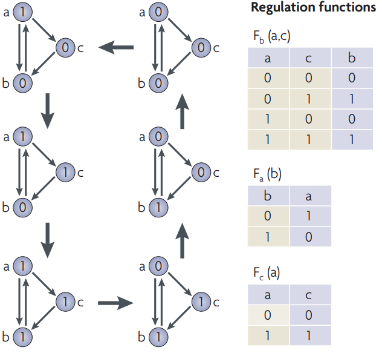
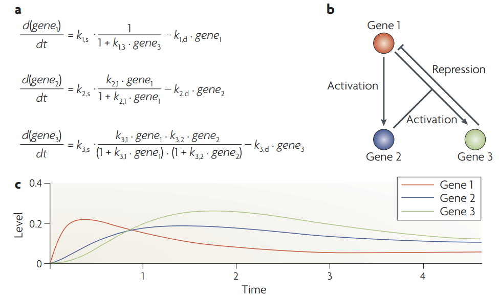
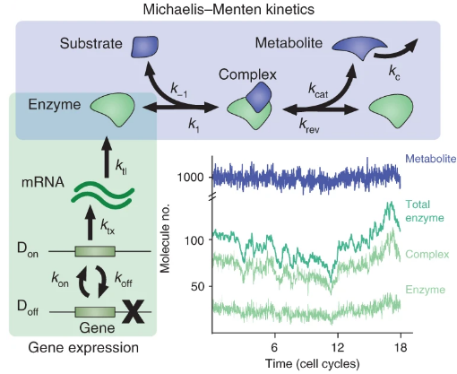
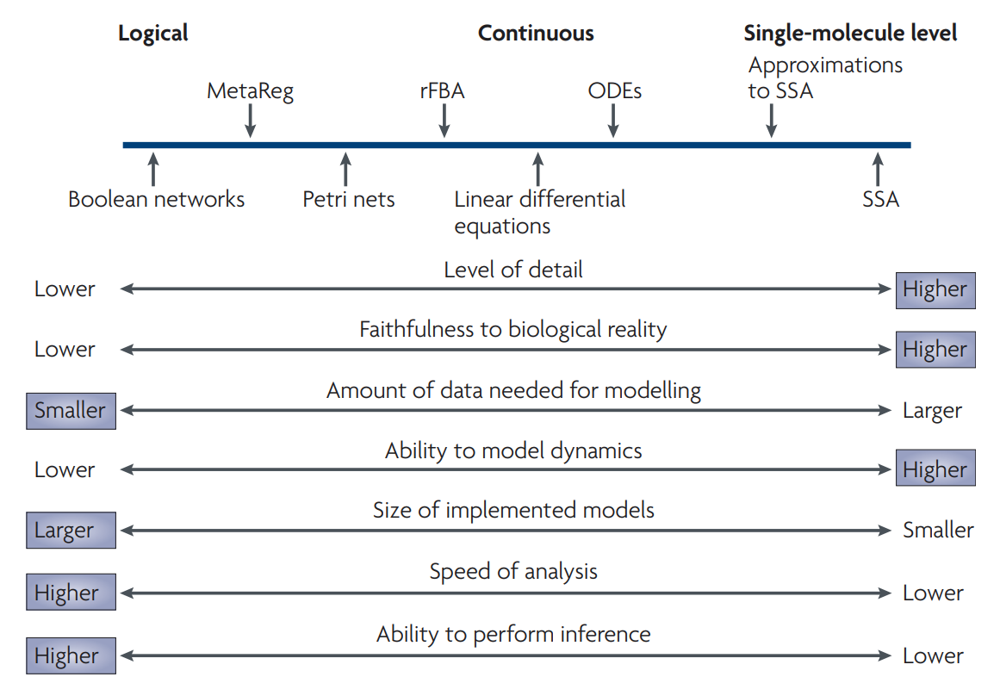

# 1. Introduction

  <b><a href="https://genomicsaotearoa.github.io/Gene_Regulatory_Networks_Simulation_Workshop/">&lt; Back to homepage</a></b> <b><a href="https://genomicsaotearoa.github.io/Gene_Regulatory_Networks_Simulation_Workshop/workshop_material/02_getting_started_sismonr.html">2. Getting started with sismonr &gt;</a></b>

## Outline

-   Do not remove this line (it will not be displayed) {:toc}

## Why simulations are important in research

One way to answer a research question is through observations and experiments. A scientist can go in the field or the lab to collect data, and analyse them to answer the question. However, this is not the only way to "do" research. The construction of mathematical or statistical models can be an alternative way of testing and generating new hypotheses. It can help us answer questions as simple as predicting the movement of planets in the Solar system, or as complex as providing a weather forecast.

> **Model**: mathematical or statistical representation of a system or phenomenon (cell, ecosystem, solar system, etc).

> **Simulation**: Using a mathematical or statistical model to generate data about the system.

Modelling and simulations are very powerful tools. In particular, they allow us to:

-   explain experimental data, through model fitting and estimation of parameters;

-   test hypotheses without going through expensive and time-consuming experiments. For example, with a model of gene expression in a cell, we can predict the impact of deleting a gene, without going through all the steps necessary to genetically modify a cell in the lab and then record the expression of its genes;

-   test scenarios that wouldn't be ethical or even feasible to test in real life (e.g. testing the impact of a drug on human embryo development, understanding the merger of two galaxies);

-   make predictions about new interventions/scenarios (e.g. what would be the consequences of new mutation in a crop, or the impact of different prevention policies on the spreading of a pandemic...);

-   communicate knowledge: e.g. simulations can be use to generate an animation of the formation of a star.

Modelling and simulations are used in many fields of science, including for example:

-   Epidemiology: modelling of infectious diseases; for example to predict the spreading of a pandemic and to assess the effects of different prevention measures (see for example a very interesting [talk from Dr Rachel Binny](https://www.youtube.com/watch?v=OhECexc9jt4) on the modelling of the COVID19 response in New Zealand);

-   Ecology: modelling of ecosystems, prediction of species abundance, evaluation of conservation policies;

-   Medicine: construction of organ models, prediction of drug-target binding and drug efficiency;

-   Chemistry, molecular biology: molecules interaction models;

-   Astrophysics: modelling of planet formation, galaxy mergers ([galaxy mergers](https://www.youtube.com/watch?v=QcDtJ_-jdMw)), etc;

-   and many more!

In biology, the study of the interaction between biological entities through modelling and simulations is known as Systems Biology ([Macilwain, 2011](https://doi.org/10.1016/j.cell.2011.02.044)). It is a very interdisciplinary field, building from numerous disciplines (physics, chemistry, biology, computer science, statistics, mathematics, etc). In particular, Systems biologists are interested in understanding the emerging properties of biological systems arising from local interactions between molecular components. This led for example to the construction of a whole-cell computational model ([Kar *et al.*, 2012](https://doi.org/10.1016/j.cell.2012.05.044)).

## What are Gene Regulatory Networks?

### An overview of gene expression

The instructions necessary to a cell's functioning are encoded in its DNA, which is composed of two anti-parallel chains of nucleotides, intertwined into a double helix. Some portions of this DNA molecule, termed protein-coding genes, contain instructions about the synthesis of proteins, which are important molecular actors fulfilling essential roles in the cell. The complex multi-step process of decoding this information and using it to produce proteins is what we call gene expression. Briefly, gene expression involves:

1.  Transcription: the sequence of nucleotides that forms the gene is copied into a "free-floating" version called messenger RNA (mRNA), as the result of a complex series of biochemical interactions involving enzymes and other molecules.
2.  Translation: the messenger RNA is used as a template to create proteins; each consecutive triplet of nucleotides is translated into a specific amino acid (the building blocks of proteins). The correspondence between triplets of nucleotides and amino acids is known as the genetic code. A sequence of amino acids is thus created from the messenger RNA template, and, once completed, constitutes the synthesised protein.
3.  Post-translational modifications: once synthesised, a protein may have to undergo some transformations before attaining its functional state. Such modifications include changes in conformation (i.e. the way in which the sequence of amino acids is folded in the 3D space), cleavage of a portion of the amino acid sequence, addition of molecular signals to specific amino acids, or binding to other proteins to form protein complexes.

<small>Image credit: Fondation Merieux</small>

### Regulation of gene expression

Cells respond and adapt to changes in the environment or other inter- and intra-cellular cues by modulating the expression of their genes, which affects the pool of available proteins. Regulation of gene expression can be achieved by different types of molecular actors: proteins encoded by other genes, regulatory non-coding RNAs (i.e. molecules of RNAs that are not used to produce proteins), or even metabolites.

Regulators can control the expression of a given target gene by affecting different steps of the target's expression:

-   Regulation of transcription: this is the most-studied type of gene expression regulation. The regulatory molecule (a protein that regulates transcription are called a transcription factor) controls the production of messenger RNAs from the target gene.
-   Regulation of translation: the regulatory molecule controls the rate at which target mRNAs are translated to synthesise proteins.
-   Decay regulation: the regulatory molecule affects the rate at which the target mRNAs or proteins are degraded.
-   Post-translational regulation: the regulator modifies the shape or sequence of its target proteins, thus affecting the ability of the target protein to perform its cellular function.

Regulators that increase the expression of their target are called activators; those decreasing the expression of their target are called repressors. Typically, the relationship between regulator and target is quite specific, with most regulators controlling the expression of only a few target genes, and most genes being controlled by a small set of regulators.

As scientists gain knowledge into the regulatory relationships between genes, they summarisethis information into graphs, which we call Gene Regulatory Networks (GRN). In these graphs, nodes represent genes, and a directed arrow from Gene A directed to Gene B informs that the products of Gene A control the expression of gene B. An example of GRN is given in Figure X.

<small>From Ma, Sisi, et al. "De-novo learning of genome-scale regulatory networks in S. cerevisiae." *Plos one* 9.9 (2014): e106479. (available under license [CC BY 4.0](https://creativecommons.org/licenses/by/4.0/) )</small>

A given environmental cue typically triggers the activation of a specific regulatory pathway (i.e. a part of the cell-wide GRN), with regulators modulating the expression of their target in a cascade. Thus, understanding the dynamics of gene expression regulation is key to deciphering how organisms react to certain triggers.

## Simulating Gene Regulatory Networks

### Classes of GRN models

One way to understand the dynamics of GRNs is through simulation; i.e. by simulating the expression over time of genes involved in the GRN. Simulating GRNs allows us to:

-   Test hypotheses about the GRN (by comparing gene expression data collected experimentally to simulations based on our current understanding of the network);
-   predict the response of an organism to a specific condition (e.g. predict the behaviour of a human cell to the presence of a hormone);
-   predict the behaviour of the system in response to modifications of the GRN (e.g. what happens when a critical gene is mutated in a cancer cell?);
-   understand the emerging properties of the system (e.g. a specific pattern of regulation leading to a particular cellular behaviour);
-   To evaluate the performance of statistical tools used to reconstruct GRNs from gene expression data (this is the main reason why `sismonr` was developed).

There are many types of models that can be developed to simulate GRNs (see [Kalerbach *et al.*, 2008](https://doi.org/10.1038/nrm2503)). For example:

-   Logical models: each gene in a GRN is considered as a switch with two states, ON and OFF. Depending on the state of a regulator at time t and the type of regulation exerted by the regulator on its target (i.e. activative or repressive), the target gene switch state (or remain in the same state) at time t+1;

<small>From Karlebach, G., Shamir, R. Modelling and analysis of gene regulatory networks. *Nat Rev Mol Cell Biol 9*, 770--780 (2008). <https://doi.org/10.1038/nrm2503>. Example of a logical model. Each node in the GRN can be in state 0 (OFF) or 1 (ON). The transition rules from one time-point to the next are displayed in the tables on the right. </small>

-   Continuous and deterministic models: differential expressions are used to describe how the concentrations of the different mRNAs and proteins evolve over time. Regulatory functions are used to describe the change in the production of mRNAs or proteins of a target gene as a function of the concentration of regulator molecules.

<small>From Karlebach, G., Shamir, R. Modelling and analysis of gene regulatory networks. *Nat Rev Mol Cell Biol* **9**, 770--780 (2008). <https://doi.org/10.1038/nrm2503>. Example of a continuous and deterministic model, for the same GRN as in the previous example. a: the set of ordinary differential equations (ODEs) used to model the GRN. b: graphical representation of the GRN. c: Solutions of the model (see the paper for the values used for the different parameters). </small>

-   Discrete and stochastic models: biochemical reactions represent the production, transformation and decay of the molecules (DNA, mRNA and proteins) present in the system of interest. A Stochastic Simulation Algorithm (SSA) is used to predict the evolution of the different molecules' absolute abundance over time, by simulating the occurrence of the different reactions in the system.

<small>From Tonn, M.K., Thomas, P., Barahona, M. et al. Stochastic modelling reveals mechanisms of metabolic heterogeneity. *Commun Biol* **2**, 108 (2019). <https://doi.org/10.1038/s42003-019-0347-0>. Example of a discrete and stochastic model. The model depicts the expression of one gene, which produces an enzyme involved in a metabolic reaction. </small>

Each type of model has its own advantages and drawbacks. In this workshop, we will be focusing on the discrete and stochastic class of models. It explicitly accounts for the stochastic noise inherent to biological systems; it is a good option to simulate GRNs as some of the regulatory molecules might be present in small numbers; but the computational burden restrict the simulations to models of GRNs of small size. The following graph by [Kalerbach *et al.*, 2008](https://doi.org/10.1038/nrm2503) provides a good overview of the main differences between different classes of GRN models.

<small>From Karlebach, G., Shamir, R. Modelling and analysis of gene regulatory networks. *Nat Rev Mol Cell Biol 9*, 770--780 (2008). <https://doi.org/10.1038/nrm2503>.</small>

A computational model of GRN is generally comprised of 3 components:

-   A graph representing the regulatory interactions between the genes;

-   A set of rules to convert the regulatory interactions into a mathematical or statistical model;

-   A set of kinetic parameters that specify the rate of the different reactions in the model.

We will come back to the second point in a later section.

### Tools to simulate GRNs

While it is possible to develop "by hand" your own model to simulate the expression of genes for a specific GRN, a number of simulators have been developed, each with its own goals, choice of programming language, and modelling assumptions. A few examples are mentioned below:

*Mention a few of the maintstream tools for GRN simulation*

In this workshop, we will use the `sismonr` R package.

## A (brief) introduction to the Stochastic Simulation Algorithm

*Some content*

---

  <b><a href="https://genomicsaotearoa.github.io/Gene_Regulatory_Networks_Simulation_Workshop/workshop_material/02_getting_started_sismonr.html">2. Getting started with sismonr &gt;</a></b>

  <b><a href="https://genomicsaotearoa.github.io/Gene_Regulatory_Networks_Simulation_Workshop/">Back to homepage</a></b>

