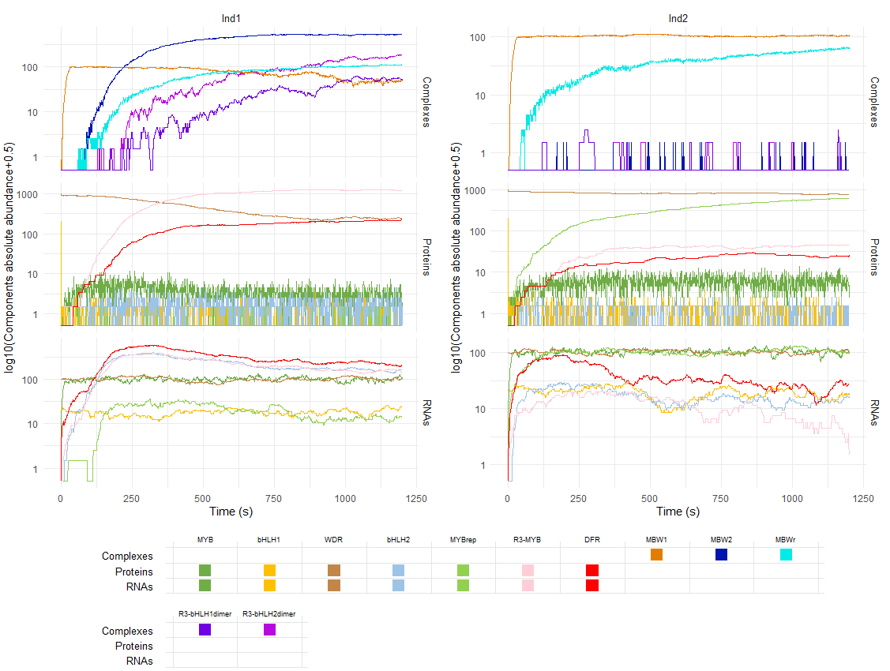

# Getting started with sismonr

<p style="text-align:left;">
    <b><a href="https://genomicsaotearoa.github.io/Gene_Regulatory_Networks_Simulation_Workshop/workshop_material/01_introduction.html">&lt; 1. Introduction</a></b>
    <span style="float:right;">
     <b><a href="https://genomicsaotearoa.github.io/Gene_Regulatory_Networks_Simulation_Workshop/workshop_material/03_scaling_up.html">3. Scaling up your work &gt;</a></b>
    </span>
</p>

## Outline
* Do not remove this line (it will not be displayed)
{:toc}

## Introduction to the sismonr package

## Workshop's challenge: modelling the anthocyanin biosynthesis regulation pathway in eudicots

For this workshop, we will work on a model for the [anthocyanin](https://en.wikipedia.org/wiki/Anthocyanin) biosynthesis regulation pathway from [eudicots](https://en.wikipedia.org/wiki/Eudicots). Anthocyanins are pgiments providing colouration to plants, flowers and fruits. This model was developed (mainly) based on the following sources:

* Albert, Nick W., et al. "A conserved network of transcriptional activators and repressors regulates anthocyanin pigmentation in eudicots." *The Plant Cell* 26.3 (2014): 962-980. <https://doi.org/10.1105/tpc.113.122069>

* Liu, Ying, et al. "Anthocyanin biosynthesis and degradation mechanisms in Solanaceous vegetables: a review." *Frontiers in Chemistry* 6 (2018): 52.<https://doi.org/10.3389/fchem.2018.00052>

* Xu, Wenjia, Christian Dubos, and Loïc Lepiniec. "Transcriptional control of flavonoid biosynthesis by MYB–bHLH–WDR complexes." *Trends in plant science* 20.3 (2015): 176-185. <https://doi.org/10.1016/j.tplants.2014.12.001>

* Baudry, Antoine, et al. "TT2, TT8, and TTG1 synergistically specify the expression of BANYULS and proanthocyanidin biosynthesis in Arabidopsis thaliana." *The Plant Journal* 39.3 (2004): 366-380. <https://doi.org/10.1111/j.1365-313X.2004.02138.x>


An animation of the GRN is presented below:


<small> Schema of the model of the anthocyanin biosynthesis regulation pathway. A static image of the model can be found [here](https://raw.githubusercontent.com/GenomicsAotearoa/Gene_Regulatory_Networks_Simulation_Workshop/main/workshop_material/images/anthocyanin_pathway_schema.png). </small>

The GRN starts with 3 protein-genes, *MYB*, *bHLH1* and *WDR*. While *bHLH1* and *WDR* are constitutively expressed (i.e. constantly produce proteins), *MYB* is only expressed in response to certain inductive conditions such as the presence of light. Their proteins assemble into a regulatory complex (termed MBW1), which activates the transcription of the *bHLH2*. The synthesised bHLH2 proteins form a second regulatory complexes with the MYB and WDR proteins (termed MBW2). This complex then activates the transcription of downstream genes encoding for enzymes involved in the anthocyanin biosynthesis pathway. The presence of these enzymes result in the production of anthocyanin. Here we use the *DFR* gene as an representative example of MBW2's targets. In addition, the MBW2 complex also activates the transcription of two repressors genes, *MYBrep* and *R3-MYB*, which form a negative feedback loop in the GRN. Both genes repress the activity of the network through different means. The MYBrep proteins bind the MBW2 complex (this new complex is termed MBWr), which becomes a repressor complex. It will inhibit the transcription of *bHLH2*, which in turn reduces the expression of the downstream enzymes and thus modulates the production of anthocyanin. The R3-MYB exert instead a passive repression on the system, by binding to bHLH1 and bHLH2 proteins, thus reducing the number of available bHLH1 and bHLH2 proteins in the system. In consequence, this reduces the number of MBW1 and MBW2 complexes in the systems and in turn the activity of the network.

The goal of this workshop will be to simulate the expression of the different genes in the pathway over a period of 1,200 seconds (20 minutes) after induction of the MYB gene. We will simulate the GRN for two different *in silico* plants:

* A wild type plant: the different kinetic parameters are set to the default values;

* A mutant plant in which the *MYBrep* gene is overexpressed: the transcription rate of the gene is increased 50-fold. This can be achieved experimentally by transforming a plant, in order to modify the promoter of the target gene.

Because the simulations are stochastic, it is better to simulate the GRN a large number of times in order to obtain a good overview of the system behaviour. We will aim to produce *need to decide on the number*.

The `sismonr` GRN and *in silico* plants can be downloaded [here](https://github.com/GenomicsAotearoa/Gene_Regulatory_Networks_Simulation_Workshop/raw/main/data/sismonr_anthocyanin_system.RData); they are available in *need to detail were it is*. The R script used to generate them can be found [here](https://github.com/GenomicsAotearoa/Gene_Regulatory_Networks_Simulation_Workshop/blob/main/scripts/generate_sismonr_system.R).


## Running a first simulation (interactive)

Once your model is ready to be simulated, the first thing to do is to test running one simulation on your local machine. For this workshop, a jupyter kernel will act as your local machine.

Start by opening a sismonr kernel *maybe need to copy again the instructions*

We will first load the `sismonr` package, and the model and in silico plants we want to simulate.

```r
library(sismonr)

load("sismonr_anthocyanin_system.RData")
```

Feel free to inspect the different aspects of the model. We can run one simulation for each of the two *in silico* plants via the command:

```r
set.seed(123)
sim <- simulateInSilicoSystem(colsystem,
                             plants, 
                             simtime = 1200,
                             ntrials = 1)
```

Where `simtime` is the time (in seconds) for which we want to simulate the expression of the genes; `ntrials` corresponds to the number of times we want to repeat the simulation for each *in silico* individual.

This should take a couple of minutes to complete. Once this is done, you can visualise the result with the `plotSimulation` function. There is the option to display only a certain subset of molecules (we'll ignore all intermediary complexes so as to not clutter the graph), and to provide custom colours and labels for the different components:


```r
plotSimulation(sim$Simulation, 
               molecules = names(colours), 
               mergeComplexes = FALSE,
               labels = id2names[names(colours)],
               colours = colours)
```



<small> Simulated gene expression for the anthocyanin biosynthesis regulation pathway. The legend shows under which form (i.e. RNA, protein or regulatory copmplex) each component can be found. For example, MYB is present in both the 'RNAs' and the 'Proteins' plots, while MBW1 is a regulatory complex, and thus only appears in the 'Complexes' plot. </small>


Pretty neat! We can see that when the *MYBrep* gene is overexpressed, the activity of the pathway is reduced, and so the downstream enzymes responsible for the synthesis of anthocyanin (represented here by the *DFR* gene) are produced in smaller quantities. This leads to a reduction in the colouration of the plant.

## Why is scaling-up important

Once important aspect to notice is that each simulation takes a long time to run! `sismonr` records the simulation running time (in seconds) for each individual:

```r
sim$runningtime
```

```
[1] 187.59 178.13
```

which corresponds to approx. 3 minutes per simulation. So if we were to run *update number* simulations for each plant, it would take *????*. This is why resources such as NeSI are essential for simulation-based research. In the next sections of this workshop, we will show you how to to (properly) scale-up these simulations on a High Performance Computer.

---

<p style="text-align:left;">
    <b><a href="https://genomicsaotearoa.github.io/Gene_Regulatory_Networks_Simulation_Workshop/workshop_material/01_introduction.html">&lt; 1. Introduction</a></b>
    <span style="float:right;">
     <b><a href="https://genomicsaotearoa.github.io/Gene_Regulatory_Networks_Simulation_Workshop/workshop_material/03_scaling_up.html">3. Scaling up your work &gt;</a></b>
    </span>
</p>

<p align="center"><b><a href="https://genomicsaotearoa.github.io/Gene_Regulatory_Networks_Simulation_Workshop/">Back to homepage</a></b></p>
