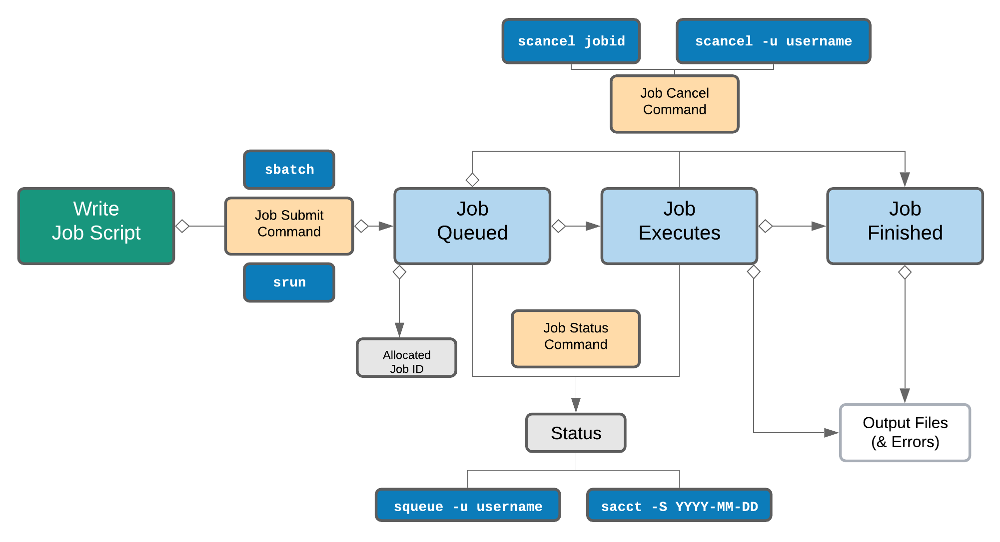

# Working with job scheduler

    <b><a href="https://genomicsaotearoa.github.io/Gene_Regulatory_Networks_Simulation_Workshop/workshop_material/03_scaling_up.html">&lt; 3. Scaling up</a></b>
    
     <b><a href="https://genomicsaotearoa.github.io/Gene_Regulatory_Networks_Simulation_Workshop/workshop_material/05_automating_large_number_of_tasks.html">5. Automating large number of tasks  &gt;</a></b>
    

## Introduction to slurm scheduler and directives

An HPC system might have thousands of nodes and thousands of users. How do we decide who gets what and when? How do we ensure that a task is run with the resources it needs? This job is handled by a special piece of software called the scheduler. On an HPC system, the scheduler manages which jobs run where and when. In brief, scheduler is a 

* Mechanism to control access by many users to shared computing resources
* Queuing / scheduling system for users’ jobs
* Manages the reservation of resources and job execution on these resources 
* Allows users to “fire and forget” large, long calculations or many jobs (“production runs”)

Why do we need a scheduler ?

* To ensure the machine is utilised as fully as possible
* Ensure all users get a fair chance to use compute resources (demand usually exceeds supply)
* To track usage - for accounting and budget control
* To mediate access to other resources e.g. software licences

Commonly used schedulers

* Slurm
* PBS , Torque
* Grid Engine
* LSF – IBM Systems
* LoadLeveller – IBM Systems

All NeSI clusters use Slurm *(Simple Linux Utility for Resource Management)* scheduler (or job submission system) to manage resources and how they are made available to users. The main commands you will use with Slurm on NeSI Mahuika cluster are:
   
---

| Command        | Function                                                                                             |
|:---------------|:------------------------------------------------------------------------------------------------------|
| `sbatch`       | Submit non-interactive (batch) jobs to the scheduler                                                 |
| `squeue`       | List jobs in the queue                                                                               |
| `scancel`      | Cancel a job                                                                                         |
| `sacct`        | displays accounting data for all jobs and job steps in the Slurm job accounting log or Slurm database|
| `srun`         | Post-translational modification                                                                      |
| `sinfo`        | Query the current state of nodes                                                                     |
| `salloc`       | Submit interactive jobs to the scheduler                                                             |

---

## Life cycle of a slurm job

 

 
 

## First slurm job

## Assessing time and memory usage

## slurm profiling

## Running more than 2 jobs (provisional)

---

    <b><a href="https://genomicsaotearoa.github.io/Gene_Regulatory_Networks_Simulation_Workshop/workshop_material/03_scaling_up.html">&lt; 3. Scaling up</a></b>
    
     <b><a href="https://genomicsaotearoa.github.io/Gene_Regulatory_Networks_Simulation_Workshop/workshop_material/05_automating_large_number_of_tasks.html">5. Automating large numbers of tasks  &gt;</a></b>
    

<b><a href="https://genomicsaotearoa.github.io/Gene_Regulatory_Networks_Simulation_Workshop/">Back to homepage</a></b>
