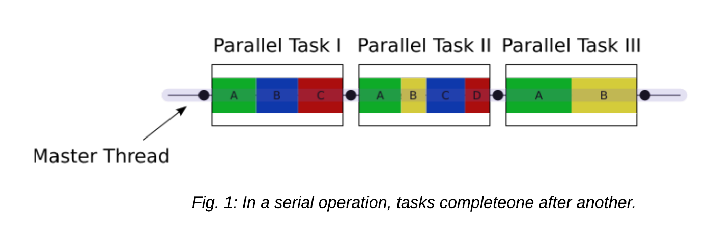

# 5. Parallel Job Arrays

<p style="text-align:left;">
    <b><a href="https://genomicsaotearoa.github.io/Gene_Regulatory_Networks_Simulation_Workshop/workshop_material/04_working_with_job_scheduler.html">&lt;  4. Working with job scheduler</a></b>
    <span style="float:right;">
     <b><a href="https://genomicsaotearoa.github.io/Gene_Regulatory_Networks_Simulation_Workshop/workshop_material/06_post_processing.html">6. Post-processing &gt;</a></b>
    </span>
</p>

## Outline
* Do not remove this line (it will not be displayed)
{:toc}

## Introduction to parallel computing

STORY TIME !

Many scientific software applications are written to take advantage of multiple CPUs in some way. But often this must be specifically requested by the user at the time they run the program, rather than happening automatically.

The scheduler provides the simplest method for running parallel computations. SLURM schedules thousands of simultaneous calculations on NeSI clusters  and will gladly execute many of your jobs at once, as long as there are available resources.

This means, that in contrast to the language-specific parallelism methods required by shared memory ( OpenMP, etc. 😕), distributed memory (MPI,etc. 😕😕), and various threading  methods built into languages like Python, Matlab, and R, slurm can provide [embarassingly parallel](https://en.wikipedia.org/wiki/Embarrassingly_parallel) calculations. These calculations, more generously called “perfectly parallel” do not require any exchange of information between individual jobs which would otherwise require a high-speed network and intelligent algorithm for communicating these data. (🤔) They scale perfectly which means that twice as much calculation can be completed in the same amount of time with twice as much hardware. This is not always *true* for true or imperfect parallel calculations

>Shared memory, Distributed memory, OpenMP, MPI ? ....none of these terms are associated with Gene Regulation 😠 
>  * Correct. However, these concepts/specifications in Parallel computing is important for the *scaling up* part of the workshop. 
>
>Okay, but can't we just call it witchcraft or black magic and move on ? 🧙‍♀️
>  * Yes we can but this will help us with writing efficient, reliable code which can run in parallel. Therefore, let's spend sometime going through theory and few exercises 🤓

---

## Shared memory vs Distributed memory


---

| Shared memory                                           | Distributed memory |
|:-----                                                   |:----- |
|In a shared memory model all processors have access to a pool of common memory that they can freely use.  | In a distributed memory model a separate segment of memory is available to each processor. Because memory isn’t shared inherently, information that must be shared between processes is sent over a network.|
||

---

Let's break this down a bit by using the schematic use for illustrating HPC architecture 

<br>
<p align="center"></p> 
<br>

>*Analogy*
>* Shared memory:
>    * Once very large whiteboard in a two-person office (the shared memory)
>    * Two people working on the same problem (threads running on different cores attached to the memory)
>    * How do they collaborate (working together but not interfering)
>    * need *private* data
>
>* Distributed memory
>    * Two whiteboards in different single-person offices (distributed memory)
>    * Two people working on the same problem (processes on different nodes attached to the interconnect)
>    * How do they collaborate ( to work on a single problem)
>    * Explicit communication ( for an example by phone. Also, no shared data)
 
## Multi-threading

Multi-threading is a method of parallelisation whereby the initial single thread of a process forks into a number of parallel threads, generally via a library such as OpenMP (Open MultiProcessing), TBB (Threading Building Blocks), or pthread (POSIX threads).

Let's take a look at the difference between a serial job and a multi-threaded job

<br>
<p align="center"></p> 
<br>
<br>
<p align="center"></p> 
<br>

### Exercise 5.1


## MPI

### Exercise 5.2

## Parallel Performance 

In general, there are two advantages to running applications in parallel: (1) applications will run more quickly and we can get our solutions faster, and (2) we can solve larger, more complex problems.

In an ideal world, if we increase the number of cores we are using by a factor of 10, we should be able to either get the solution to our current problem 10 times faster, or to run a system 10 times bigger in the same amount of time as now.

Unfortunately, this is often not the case…

### Strong vs. weak scaling

Scaling describes how the runtime of a parallel application changes as the number of processors is increased. Usually, there are two types of scaling of interest:

* **strong scaling** is obtained by increasing the number of processors P used for a problem of fixed size/complexity N. As the number of processors increases, the amount of work per processor should decrease.
* **weak scaling** is obtained by increasing both the number of processors and the system size/complexity, with both of these being increased at the same rate.

Ideally, for strong scaling, the runtime will keep decreasing in direct proportion to the growing number of processors used. For weak scaling, the ideal situation is for the runtime to remain constant as the system size, and number of processors used, are increased. In general, good strong scaling is more relevant for most scientific problems, but is also more difficult to achieve than weak scaling.

#### Amdhal’s law and strong scaling

The limitations of strong scaling are best illustrated by Amdhal’s law: “The performance improvement to be gained by parallelisation is limited by the proportion of the code which is serial”. As more processors are used, the runtime becomes more and more dominated by the serial portion of a code.

<br>
<p align="center"></p> 
<br>

#### Gustafson’s law and weak scaling

Gustafson’s law provides a solution to the limitations of strong scaling described. The proposal is simply: we should run larger jobs on larger processor counts. If we run larger problems, then the parallelisable part of the problem will increase. We are still limited by the serial part of the code, but this becomes less important, and we can run on more processors more efficiently.

<br>
<p align="center"></p> 
<br>

#### Load imbalance

The laws and thoughts above only apply to cases where all processors are equally busy. What happens if some processors run out of work while others are still busy?

Scalibility isn’t everything! It’s also important to make the best use of all processors at hand before increasing the number of processors.


## Slurm job arrays

Job arrays offer a mechanism for submitting and managing collections of similar jobs quickly and easily; job arrays with millions of tasks can be submitted in milliseconds (subject to configured size limits). All jobs must have the same initial options (e.g. size, time limit, etc.)

In brief, Job arrays allow you to leverage Slurm’s ability to create multiple jobs from one script. Many of the situations where this is useful include:

* Establishing a list of commands to run and have a job created from each command in the list.
* Running many parameters against one set of data or analysis program.
* Running the same program multiple times with different sets of data. 

<br>
<p align="center"></p> 
<br>

### Exercise 5.3

Let's start compiling our first slurm array script

* Purpose is to execute the same `sleep 40 ` command we used in *Working with job scheduler* episode but we want to run five iterations of it 

>```bash
>
>#confirm the working directory is correct
>$ pwd
>/nesi/project/nesi02659/sismonr_workshop/workingdir/me123/5_parallel
>
>#Create a new sub-directory and name it slurm_arrays and change the directory to this
>$ mkdir -p slurm_arrays/{Exercise_1/slurmout,Exercise_2/slurmout,Exercise_3/slurmout} && cd slurm_arrays/Exercise_1
>
>#use a text editor of choice to create a file named firstslurm_array.sl - we will use nano here
>$ nano firstslurm_array.sl
>```

>Content of `firstslurm_array.sl` should be as below. Please discuss as you make progress
>```bash
>#!/bin/bash -e
>
>#SBATCH --account       nesi02659
>#SBATCH --job-name      first_slurm_Array
>#SBATCH --time          00:00:50
>#SBATCH --output        slurmout/sleeparray.%A.%a.out
>#SBATCH --cpus-per-task 1
>#SBATCH --mem           100
>#SBATCH --array         1-5
>#SBATCH --export        NONE
>
>export SLURM_EXPORT_ENV=ALL	
>
>srun sleep 40
>
>echo "I am a slurm job and I slept for 40 seconds but this time in Parallel"
>echo "This is the result for ${SLURM_ARRAY_TASK_ID}"
>```

>Let's review some of those new slurm directives and variables prior to submitting the script
> * Job arrays are only supported for batch jobs and the array index values are specified using the `--array` or `-a` option. This is the most important directive in an array script
> * .out filename %A and %a where : %A will be replaced by the value of `SLURM_ARRAY_JOB_ID` (will be set to the first job ID of the array)  and %a will be replaced by the value of `SLURM_ARRAY_TASK_ID`(will be set to the job array index value). Let's review the meaning of these two variables after submitting the job

* Once you submit the job with `sbatch firstslurm_array.sl`, take a not on the jobid and run the command `squeue -j jobid`. For an example, let's use the hypothetical job id 23284978 and view the output

>```bash
>$ squeue -j 23284978
>
>JOBID         USER     ACCOUNT   NAME        CPUS MIN_MEM PARTITI START_TIME     TIME_LEFT STATE    NODELIST(REASON)    
>23284978_1    me123  nesi02659 first_slurm_   2    100M large   Nov 28 09:26        0:57 RUNNING  wbn094              
>23284978_2    me123  nesi02659 first_slurm_   2    100M large   Nov 28 09:26        0:57 RUNNING  wbn094              
>23284978_3    me123  nesi02659 first_slurm_   2    100M large   Nov 28 09:26        0:57 RUNNING  wbn096              
>23284978_4    me123  nesi02659 first_slurm_   2    100M large   Nov 28 09:26        0:57 RUNNING  wbn096              
>23284978_5    me123  nesi02659 first_slurm_   2    100M large   Nov 28 09:26        0:57 RUNNING  wbn096   
>```

### Exercise 5.4

>Objective of this exercise is to to run slurm array with two indexes for 500 simulations.  

### Exercise 5.5 (Group)

>* Host will assign you to a breakout room (zoom) or a group. 
>* Given the time constraint and the amount of resources required to run all of the simulations, each group will submit a **single** array job with 250 indexes

---

<p style="text-align:left;">
    <b><a href="https://genomicsaotearoa.github.io/Gene_Regulatory_Networks_Simulation_Workshop/workshop_material/04_working_with_job_scheduler.html">&lt;  4. Working with job scheduler</a></b>
    <span style="float:right;">
     <b><a href="https://genomicsaotearoa.github.io/Gene_Regulatory_Networks_Simulation_Workshop/workshop_material/06_post_processing.html">6. Post-processing &gt;</a></b>
    </span>
</p>

<p align="center"><b><a href="https://genomicsaotearoa.github.io/Gene_Regulatory_Networks_Simulation_Workshop/">Back to homepage</a></b></p>